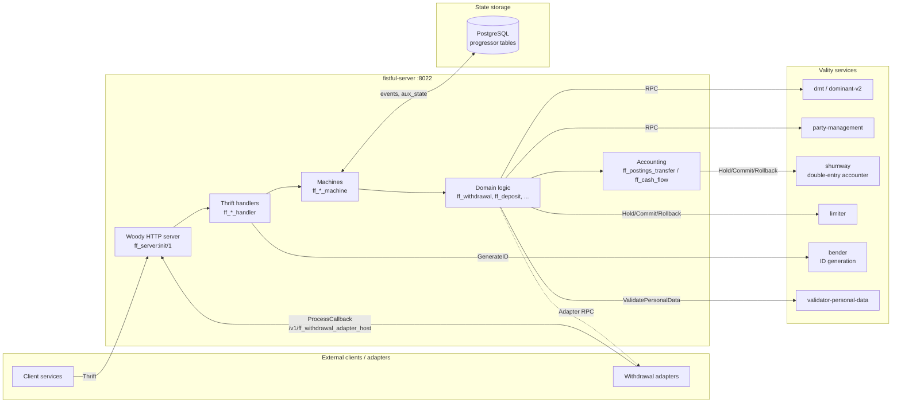

# Fistful Server Documentation

Fistful is an Erlang/OTP wallet‑processing service built on top of [Vality](https://github.com/valitydev)'s
event‑sourced state‑machine platform (`machinery` + `progressor`). It persists every domain
entity — sources, destinations, deposits, withdrawals, withdrawal sessions — as an ordered
event log in PostgreSQL, exposes a Thrift/Woody RPC API over HTTP port `8022`, and orchestrates
the money‑movement lifecycle by talking to external Vality services (dominant / DMT for domain
config, party‑management, shumway for double‑entry accounting, limiter for turnover limits,
bender for idempotent ID generation, and pluggable withdrawal adapters).

## Table of Contents

| File | What it covers |
|------|----------------|
| [architecture.md](architecture.md) | Top‑level architecture, supervision tree, process model |
| [applications.md](applications.md) | The OTP umbrella apps: `ff_core`, `fistful`, `ff_transfer`, `ff_server`, `ff_validator`, `machinery_extra`, `ff_cth` |
| [domain-model.md](domain-model.md) | Core entities and their relationships: party → wallet → source/destination → deposit/withdrawal → session → adjustment |
| [state-machines.md](state-machines.md) | Each machinery namespace, the events it emits, and its state transitions |
| [withdrawal-flow.md](withdrawal-flow.md) | End‑to‑end processing of a withdrawal, activity dispatcher, adapter sessions, route exhaustion |
| [deposit-flow.md](deposit-flow.md) | End‑to‑end processing of a deposit |
| [accounting.md](accounting.md) | Postings transfers, cash flow resolution, fees, accounter integration |
| [routing.md](routing.md) | Routing rulesets, provider/terminal selection, turnover‑limit filtering |
| [adjustments.md](adjustments.md) | Adjustment change types, replay semantics, cash‑flow inversion |
| [adapter-integration.md](adapter-integration.md) | Withdrawal provider protocol, callbacks, adapter host |
| [rpc-api.md](rpc-api.md) | Woody/Thrift service surface exposed on `:8022` |
| [persistence.md](persistence.md) | Progressor backend, machinery schemas, event serialization |
| [configuration.md](configuration.md) | `sys.config`, `vm.args`, `.env`, application environment keys |
| [external-services.md](external-services.md) | DMT, party‑management, shumway, limiter, bender, validator |
| [observability.md](observability.md) | Prometheus, OpenTelemetry, scoper, health checks, internal trace endpoint |
| [development.md](development.md) | Build, test, lint, dialyze, release, docker workflow |
| [operations.md](operations.md) | Deployment model, healthchecks, repair scenarios |
| [glossary.md](glossary.md) | Terminology cheat‑sheet |

## Top‑level architecture

> [!NOTE]
> Clients speak Thrift‑over‑HTTP (Woody). Every entity lives in its own progressor
> namespace, persisted to PostgreSQL as a strictly ordered event stream. State is
> reconstructed in memory via `ff_machine:collapse/2`. Money movement is effected
> by `shumway` (the double‑entry accounter); fistful only records intent and
> coordinates the lifecycle.

## Reading order

For someone new to the codebase:

1. Read this file, then [architecture.md](architecture.md).
2. Skim [applications.md](applications.md) to map the umbrella.
3. Read [domain-model.md](domain-model.md) for the vocabulary.
4. Follow one flow end‑to‑end: [withdrawal-flow.md](withdrawal-flow.md) is the
   most complex and exercises every subsystem.
5. Drill into specific topics as needed.

## Canonical source references

This project is written in Erlang/OTP 27.1.2 (see [.env:5](../.env) and
[rebar.config:29](../rebar.config)). The prod release target is built via
`rebar3 as prod release` (see [Makefile:88](../Makefile)) and packaged into a
Docker image by [Dockerfile](../Dockerfile). Local test orchestration uses
[compose.yaml](../compose.yaml) plus the optional tracing overlay
[compose.tracing.yaml](../compose.tracing.yaml).
