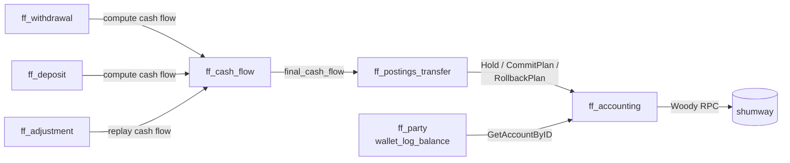
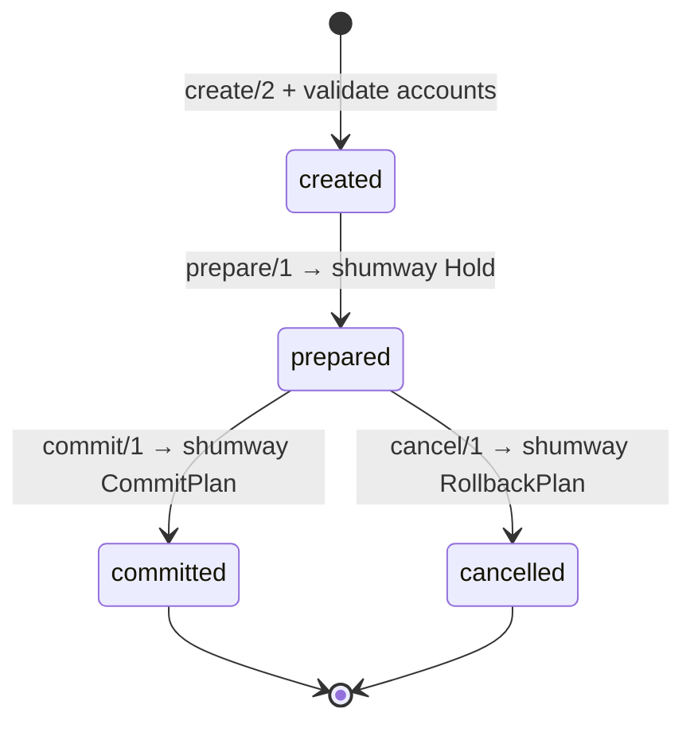

# Accounting

Fistful records money movement **intent**; the actual double‑entry
bookkeeping lives in `shumway` (the Vality accounter). Every transfer is
modeled as a `final_cash_flow` (a list of postings) that shumway either
holds, commits, or rolls back.

## Actors



## Plan → final

A **plan** cash flow describes where money flows symbolically. A
**final** cash flow is the plan with every plan‑account resolved to an
actual account ID and every plan‑volume resolved to a concrete cash.

### Plan accounts

Defined in [`ff_cash_flow:plan_account/0`](../apps/fistful/src/ff_cash_flow.erl#L73):

| Tag | Meaning |
|-----|---------|
| `{wallet, sender_source}` | The originating wallet's source account |
| `{wallet, sender_settlement}` | The originating wallet's settlement account (debit side) |
| `{wallet, receiver_settlement}` | The receiving wallet's settlement account (credit side) |
| `{wallet, receiver_destination}` | The receiving destination's account |
| `{system, settlement}` | System settlement (platform's general ledger) |
| `{system, subagent}` | System subagent (the PI's subagent account) |
| `{provider, settlement}` | Provider's own settlement account |

Account resolution happens in
[`ff_cash_flow:finalize/3`](../apps/fistful/src/ff_cash_flow.erl#L9)
against an `account_mapping :: #{plan_account() => account()}` the caller
builds by combining wallet accounts, PI system accounts and provider
accounts.

### Plan volumes

Defined in [`ff_cash_flow:plan_volume/0`](../apps/fistful/src/ff_cash_flow.erl#L25):

- `{fixed, cash()}` — literal amount.
- `{share, {rational(), plan_constant(), rounding_method()}}` — a
  fractional share of a constant (e.g. 1% of `operation_amount`), with an
  explicit rounding mode (`default`, `round_half_towards_zero`,
  `round_half_away_from_zero`).
- `{product, {min_of | max_of, [plan_volume()]}}` — combinator for caps
  or floors.

The constants are supplied through a `constant_mapping` (typically just
`#{operation_amount => Cash}`) and evaluated recursively by
[`ff_cash_flow:compute_volume/2`](../apps/fistful/src/ff_cash_flow.erl#L15).

### Final posting

```erlang
-type final_posting() :: #{
    sender   := final_account(),
    receiver := final_account(),
    volume   := cash(),
    details  => binary()
}.
```

Every posting is a transfer of `volume` from `sender` to `receiver`,
both identified by `ff_account:account()` records (account id + currency
+ realm).

## Postings transfer lifecycle

[`ff_postings_transfer`](../apps/fistful/src/ff_postings_transfer.erl) wraps
the shumway RPCs into a four‑state lifecycle:



### `create/2`

[ff_postings_transfer.erl:77](../apps/fistful/src/ff_postings_transfer.erl#L77)

Validates before emitting any events:

- **Non‑empty** — empty posting list → `{error, empty}`.
- **Currency** — every posting's accounts share the same currency
  (`valid = validate_currencies(...)`).
- **Realm** — every posting stays within one realm
  (`valid = validate_realms(...)`).
- **Accessibility** — every referenced account is accessible
  (`accessible = validate_accessible(...)`).

Emits `[{created, Transfer}, {status_changed, created}]`.

### `prepare/1` / `commit/1` / `cancel/1`

Each emits a single `{status_changed, _}` event. The actual I/O is in
[`ff_accounting`](../apps/fistful/src/ff_accounting.erl):

| Erlang call | Shumway RPC |
|-------------|-------------|
| `ff_accounting:prepare_trx/2` | `Accounter.Hold(PlanChange)` |
| `ff_accounting:commit_trx/2` | `Accounter.CommitPlan(PlanChange)` |
| `ff_accounting:cancel_trx/2` | `Accounter.RollbackPlan(PlanChange)` |
| `ff_accounting:balance/1,2` | `Accounter.GetAccountByID(id)` |
| `ff_accounting:create_account/2` | `Accounter.CreateAccount(proto)` |

See [ff_accounting.erl:25‑32](../apps/fistful/src/ff_accounting.erl#L25).

> [!TIP]
> Hold → Commit/Rollback gives two‑phase commit semantics. If the system
> crashes between Hold and Commit, the hold survives; on the next
> `process_timeout` the machine walks the activity chain again, re‑derives
> the same plan ID, and shumway's idempotency turns the second Hold into
> a no‑op before the Commit is issued.

## Account creation

Wallet settlement accounts are not created by fistful; they come with the
wallet configuration in `party-management`. Fistful *uses* them via
[`ff_party:get_wallet_account/1`](../apps/fistful/src/ff_party.erl#L64) and
[`ff_party:build_account_for_wallet/2`](../apps/fistful/src/ff_party.erl#L62).

System and provider accounts are configured in DMT (domain config) at the
payment‑institution level and fetched via
[`ff_payment_institution:system_accounts/2`](../apps/fistful/src/ff_payment_institution.erl).

## Balances

[`ff_accounting:balance/1`](../apps/fistful/src/ff_accounting.erl#L35)
returns `{ok, {ff_indef:indef(amount()), currency_id()}}`. `indef` is a
three‑value arithmetic from
[`ff_indef`](../apps/ff_core/src/ff_indef.erl) that captures `own_amount`,
`min_available`, `max_available` — shumway reports these three figures so
callers can reason about funds in flight (held but not committed).

The wallet's current balance is also periodically logged out of fistful
via
[`ff_party:wallet_log_balance/2`](../apps/fistful/src/ff_party.erl#L63)
after each successful withdrawal commit.

## Fees

A provider/terminal's **cash flow plan** is expressed as a pair of fee
plans plus the base postings. Fistful gathers those via
[`ff_party:compute_provider_terminal_terms/4`](../apps/fistful/src/ff_party.erl#L76)
and applies them with
[`ff_cash_flow:add_fee/2`](../apps/fistful/src/ff_cash_flow.erl#L10)
before finalizing. See
[`ff_fees_plan`](../apps/fistful/src/ff_fees_plan.erl) and
[`ff_fees_final`](../apps/fistful/src/ff_fees_final.erl).

## Idempotence of the posting plan

The plan ID (`ff_accounting:id()`) is constructed deterministically from
the withdrawal/deposit ID, the route, and the iteration — see
[`ff_withdrawal:construct_p_transfer_id/1`](../apps/ff_transfer/src/ff_withdrawal.erl#L962)
for the withdrawal case. Shumway uses this ID to dedupe, so even when
progressor retries `process_timeout` after a crash mid‑operation, the net
effect on balances is identical to a single successful walk.

## Cash flow inversion (for adjustments)

[`ff_cash_flow:inverse/1`](../apps/fistful/src/ff_cash_flow.erl#L12)
produces the mirror image of a final cash flow — every posting's sender
and receiver are swapped. Adjustments use this to undo a previously
committed cash flow before applying a new one. See
[adjustments.md](adjustments.md).

## Local limits vs external limiter

Two separate mechanisms:

| Kind | Where | Scope | How |
|------|-------|-------|-----|
| Wallet cash‑range limits | [`ff_party:validate_wallet_limits/2`](../apps/fistful/src/ff_party.erl#L72) | Wallet‑local balance bounds | One‑shot check against shumway balance |
| Turnover limits | [`ff_limiter`](../apps/ff_transfer/src/ff_limiter.erl) + external `limiter` service | Per provider / terminal / wallet, over a timespan | Reserve‑then‑commit; idempotent |
| Process‑internal limits | [`ff_limit`](../apps/fistful/src/ff_limit.erl) | Local machinery for counting (unused in prod paths) | Machinery namespace per limit |

The external `limiter` service is the load‑bearing one for withdrawal
path. See [external-services.md](external-services.md).
