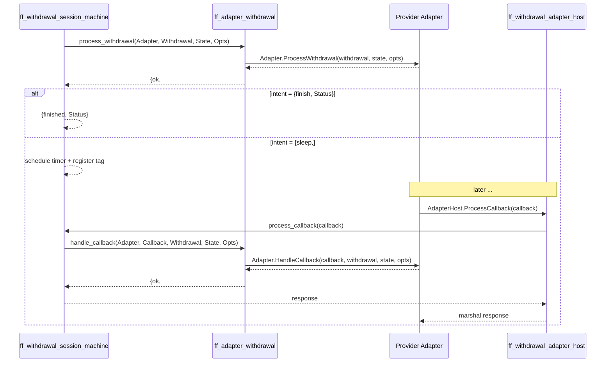

# Adapter Integration

Withdrawal providers (the external systems that actually move money to
bank cards, wallets, crypto, etc.) speak Thrift to fistful over the
`dmsl_wthd_provider_thrift:Adapter` and `AdapterHost` services. Fistful
calls the *Adapter* outbound; the adapter calls *AdapterHost* back to
notify of asynchronous outcomes.

## Two services



## Outbound: `ff_adapter_withdrawal`

[`ff_adapter_withdrawal`](../apps/ff_transfer/src/ff_adapter_withdrawal.erl) is
the single client. Entry points:

- `process_withdrawal/4` — first call and every wake‑up.
- `handle_callback/5` — when a tagged callback arrives.
- `get_quote/3` — price discovery prior to Create.

### The withdrawal payload

```erlang
-type withdrawal() :: #{
    id             => binary(),
    session_id     => binary(),
    resource       => ff_destination:resource(),
    dest_auth_data => ff_destination:auth_data(),
    cash           => ff_accounting:body(),
    sender         => ff_party:id(),
    receiver       => ff_party:id(),
    quote          => quote(),
    contact_info   => ff_withdrawal:contact_info()
}.
```

The payload is marshalled to
`dmsl_wthd_domain_thrift:'Withdrawal'` via
[`ff_adapter_withdrawal_codec`](../apps/ff_transfer/src/ff_adapter_withdrawal_codec.erl).

### Intent types

```erlang
-type intent() ::
    {finish, finish_status()}
  | {sleep,  #{timer        := machinery:timer(),
               callback_tag => ff_withdrawal_callback:tag(),
               user_interaction => user_interaction()}}.

-type finish_status() :: success | {failed, failure()}.
```

`finish` ends the session. `sleep` parks the session until either:

- The timer expires (→ `ProcessWithdrawal` is re‑invoked with the current
  `AdapterState`), **or**
- A callback with the registered `callback_tag` arrives at
  `ff_withdrawal_adapter_host`.

### Transaction info

The adapter can bind a `TransactionInfo` (provider's own trx ID,
extra metadata) to the session by returning `trx_info` in the result.
Session records it as `{transaction_bound, TrxInfo}` so later callbacks
can be reconciled.

## Inbound: `ff_withdrawal_adapter_host`

[`ff_withdrawal_adapter_host`](../apps/ff_server/src/ff_withdrawal_adapter_host.erl)
is a `ff_woody_wrapper`‑based handler for the
`dmsl_wthd_provider_thrift:'AdapterHost'` service. It's bound to the HTTP
path `/v1/ff_withdrawal_adapter_host` (see
[`ff_services:get_service_path(ff_withdrawal_adapter_host)`](../apps/ff_server/src/ff_services.erl#L47)).

Single RPC: `ProcessCallback(Callback)`. The handler:

1. Unmarshals the callback via `ff_adapter_withdrawal_codec:unmarshal/2`.
2. Dispatches to
   [`ff_withdrawal_session_machine:process_callback/1`](../apps/ff_transfer/src/ff_withdrawal_session_machine.erl#L27).
3. Translates outcomes:
   - `{ok, Response}` → `{succeeded, Response}`.
   - `{error, {session_already_finished, Context}}` → `{finished, Context}`
     (the provider asks for the current finished state, they don't
     resurrect the session).
   - `{error, {unknown_session, _}}` → raise `#wthd_provider_SessionNotFound{}`.

## Tag → session lookup

Callbacks are routed to sessions by the **tag** the session registered
when it went to sleep. The mapping is maintained by
[`ff_machine_tag`](../apps/fistful/src/ff_machine_tag.erl) (a separate
machinery namespace dedicated to tag bookkeeping) and wrapped per session
in
[`ff_withdrawal_callback_utils`](../apps/ff_transfer/src/ff_withdrawal_callback_utils.erl):

```erlang
-opaque index() :: #{callbacks := #{tag() => callback()}}.
```

Helper functions:

- `new_index/0` — empty.
- `wrap_event/2` / `unwrap_event/1` — bridge callback events into the
  session event stream.
- `get_by_tag/2` — find callback state by tag.
- `process_response/2` — apply the response returned by the adapter.

## Session‑side callback processing

[`ff_withdrawal_session:process_callback/2`](../apps/ff_transfer/src/ff_withdrawal_session.erl#L20):

1. Look up callback by tag.
2. Emit `{callback, {status_changed, pending}}` (via
   `ff_withdrawal_callback_utils`).
3. Invoke `ff_adapter_withdrawal:handle_callback/5` with the current
   adapter state.
4. Apply the returned `intent` exactly as for `ProcessWithdrawal`.
5. Emit `{callback, {finished, #{response => Response}}}`.
6. Return the `Response` payload to the caller (the adapter host), which
   marshals it back to the provider.

## Retries and timeouts

Defined in [`ff_withdrawal_session_machine`](../apps/ff_transfer/src/ff_withdrawal_session_machine.erl):

- `?SESSION_RETRY_TIME_LIMIT` — total clock time the session may spend
  retrying before giving up (24 hours).
- `?MAX_SESSION_RETRY_TIMEOUT` — cap on the sleep interval between retries
  (4 hours).

Transient provider errors (e.g. HTTP 503) do not fail the session — the
adapter returns `{failed, Failure}` with a *retryable* failure reason,
configured through
[`ff_transfer.withdrawal.default_transient_errors`](../config/sys.config#L222)
and per‑party
[`ff_transfer.withdrawal.party_transient_errors`](../config/sys.config#L227).
On a retryable failure the session schedules another attempt; on a
terminal failure it emits `{finished, {failed, _}}` and notifies the
withdrawal.

## Quote flow

`ff_adapter_withdrawal:get_quote/3` returns:

```erlang
-type quote() :: #{
    cash_from := cash(),
    cash_to   := cash(),
    quote_data := term()   %% opaque, provider-specific
}.
```

The `quote_data` is an opaque blob that the provider supplies now and
wants echoed back later during `ProcessWithdrawal` — so the quote can be
honoured at exchange. Fistful doesn't interpret it; it stores it in the
withdrawal (`ff_withdrawal:quote/1`) and forwards it verbatim.

## Provider/adapter registry

Providers are looked up through
[`ff_payouts_provider`](../apps/fistful/src/ff_payouts_provider.erl) and
their terminals through
[`ff_payouts_terminal`](../apps/fistful/src/ff_payouts_terminal.erl) — both
return a `ProviderConfig`/`TerminalConfig` from DMT. Fistful expects each
provider to expose an **adapter URL** and an **options map**; the adapter
URL is what
[`ff_adapter_withdrawal:get_adapter_with_opts/1,2`](../apps/ff_transfer/src/ff_withdrawal_session.erl#L23)
uses to build a Woody client.
