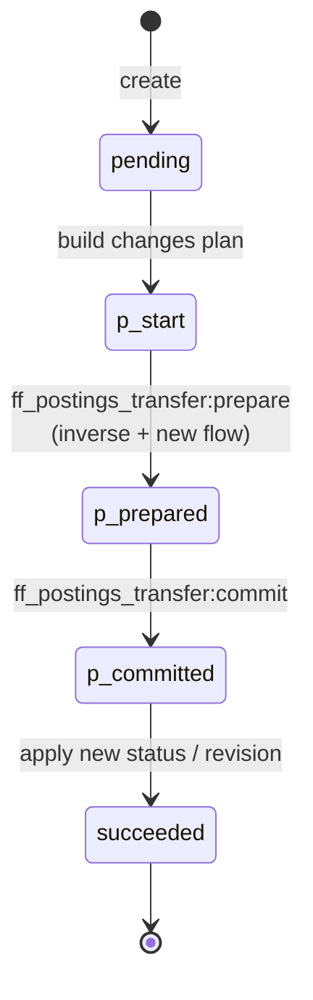
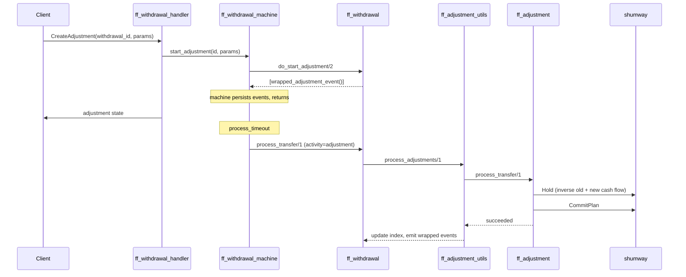

# Adjustments

An adjustment corrects an already‑finished deposit or withdrawal. It can
either flip the terminal status (`succeeded` ↔ `failed`) or replay the
cash flow against a fresher domain revision (e.g. because fees changed and
we want to reprice an old transfer).

## Shape

[`ff_adjustment:adjustment/0`](../apps/ff_transfer/src/ff_adjustment.erl):

```erlang
-type adjustment() :: #{
    version             := 1,
    id                  := id(),
    status              := pending | succeeded,
    created_at          := ff_time:timestamp_ms(),
    changes_plan        := changes(),
    domain_revision     := ff_domain_config:revision(),
    operation_timestamp := ff_time:timestamp_ms(),
    external_id         => id(),
    p_transfer          => ff_postings_transfer:transfer() | undefined
}.

-type changes() :: #{
    new_cash_flow       => #{old_cash_flow_inverted, new_cash_flow},
    new_status          => #{new_status := status()},
    new_domain_revision => #{new_domain_revision := domain_revision()}
}.
```

## Kinds of change

From [`ff_withdrawal:adjustment_change/0`](../apps/ff_transfer/src/ff_withdrawal.erl#L163):

```erlang
-type adjustment_change() ::
      {change_status,     status()}
    | {change_cash_flow,  domain_revision()}.
```

1. **`change_status`** — override the terminal status. Valid targets are
   the other terminal state (`succeeded` → `{failed, F}` or vice versa).
   Attempting to change to `pending`, or to a status equal to the current
   one, is rejected as
   [`invalid_status_change_error`](../apps/ff_transfer/src/ff_withdrawal.erl#L178).
2. **`change_cash_flow`** — rebuild the cash flow at the supplied domain
   revision and apply the delta: inverse the old one, apply the new one.
   Rejected if the withdrawal is in a status that doesn't support it, or
   if the withdrawal's current domain revision already equals the
   requested one
   ([`start_adjustment_error`](../apps/ff_transfer/src/ff_withdrawal.erl#L167)).

Only one adjustment can be in flight at a time
(`{another_adjustment_in_progress, adjustment_id()}` otherwise).

## Lifecycle



Adjustments never emit `failed` — they always commit. The business
guards at creation time are what keep things safe.

## Index

[`ff_adjustment_utils`](../apps/ff_transfer/src/ff_adjustment_utils.erl)
holds every adjustment on the owning entity:

```erlang
-opaque index() :: #{
    adjustments     := #{id() => adjustment()},
    inversed_order  := [id()],
    active          => id(),
    cash_flow       => final_cash_flow(),
    domain_revision => domain_revision()
}.
```

- `active` is the ID of the adjustment currently being processed (if
  any); `is_active/1` returns whether one is in flight.
- `cash_flow` is the **effective** final cash flow after all committed
  adjustments. `ff_withdrawal:effective_final_cash_flow/1`
  ([ff_withdrawal.erl:514](../apps/ff_transfer/src/ff_withdrawal.erl#L514))
  exposes this to the outside world.
- `domain_revision` is the effective revision (useful for auditing which
  DMT snapshot was actually applied).
- Events are wrapped and unwrapped via
  [`ff_adjustment_utils:wrap_event/2, unwrap_event/1`](../apps/ff_transfer/src/ff_adjustment_utils.erl)
  so the parent entity can treat adjustment events as opaque.

## Dispatch from the withdrawal machine



Entry points:

- Thrift: `CreateAdjustment` on the withdrawal management service →
  [`ff_withdrawal_handler:handle_function_('CreateAdjustment', ...)`](../apps/ff_server/src/ff_withdrawal_handler.erl#L142).
- Erlang: [`ff_withdrawal_machine:start_adjustment/2`](../apps/ff_transfer/src/ff_withdrawal_machine.erl#L60).
- Domain: [`ff_withdrawal:start_adjustment/2`](../apps/ff_transfer/src/ff_withdrawal.erl#L494).

During `process_timeout`, the activity dispatcher returns `adjustment`
whenever `ff_adjustment_utils:is_active/1` returns `true`. The adjustment
then walks its own mini activity chain (start → prepare → commit → finish)
embedded inside the parent machine's event stream.

## Cash‑flow inversion detail

When `change_cash_flow` is applied, the new final cash flow is NOT simply
the newly computed one — it's the **delta**:

1. Start from the current effective flow.
2. Append its [inverse](../apps/fistful/src/ff_cash_flow.erl#L12) (senders
   and receivers swapped, same volumes).
3. Append the newly computed flow at the fresh domain revision.

That concatenation is the cash flow of the adjustment's own posting
transfer. Shumway sees it as a single balanced plan; net effect on the
books is "replace old with new".

## Operation timestamp

Every adjustment stores an `operation_timestamp` (the original
withdrawal's timestamp, *not* the adjustment's creation time). This is
the timestamp shumway and the limiter get — adjustments are a posteriori
corrections, not new operations in the current period.
[`ff_withdrawal:operation_timestamp/1`](../apps/ff_transfer/src/ff_withdrawal.erl#L669).

## Errors

From
[`ff_withdrawal:start_adjustment_error/0`](../apps/ff_transfer/src/ff_withdrawal.erl#L167):

- `{invalid_withdrawal_status, status()}` — adjustment only valid on
  finished withdrawals.
- `{invalid_status_change, {unavailable_status | already_has_status, _}}`.
- `{another_adjustment_in_progress, id()}`.
- `{invalid_cash_flow_change, {already_has_domain_revision, _} |
  {unavailable_status, _}}`.
- `ff_adjustment:create_error()` — e.g. posting transfer rejections.

These are mapped to Thrift exceptions in
[ff_withdrawal_handler.erl:142‑](../apps/ff_server/src/ff_withdrawal_handler.erl#L142).
