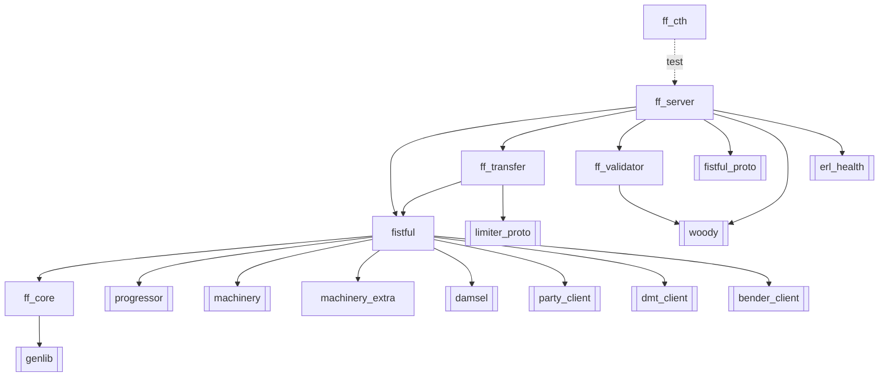

# Applications

The project is an OTP umbrella laid out under `apps/` (see
[rebar.config:69](../rebar.config#L69) — note that `ff_claim` and `w2w` are
listed as project dirs but are not present in this working copy). Only the
seven directories below exist; each is its own OTP application.

## `ff_core`

Pure utility library with **no** Vality deps — see
[ff_core.app.src](../apps/ff_core/src/ff_core.app.src).

| Module | Role |
|--------|------|
| [`ff_pipeline`](../apps/ff_core/src/ff_pipeline.erl) | `do/1`, `unwrap/1`, `valid/2`, `with/3` — the error‑propagation monad used everywhere |
| [`ff_maybe`](../apps/ff_core/src/ff_maybe.erl) | Option helpers |
| [`ff_map`](../apps/ff_core/src/ff_map.erl) | Map helpers |
| [`ff_range`](../apps/ff_core/src/ff_range.erl) | Inclusive/exclusive bounded ranges (used for cash ranges) |
| [`ff_time`](../apps/ff_core/src/ff_time.erl) | `timestamp_ms/0`, RFC3339 helpers |
| [`ff_indef`](../apps/ff_core/src/ff_indef.erl) | Indefinite arithmetic (min/max/avg) for balances |
| [`ff_string`](../apps/ff_core/src/ff_string.erl) | String utilities |
| [`ff_random`](../apps/ff_core/src/ff_random.erl) | Randomness helpers |
| [`ff_failure`](../apps/ff_core/src/ff_failure.erl) | Common failure representation |

## `fistful`

The domain core: parties, wallets, accounts, cash, cash flows, the machinery
wrapper. See [fistful.app.src](../apps/fistful/src/fistful.app.src).

Key modules:

| Module | Role |
|--------|------|
| [`fistful`](../apps/fistful/src/fistful.erl) | `machinery` + `machinery_backend` façade — dispatches progressor callbacks to per‑namespace handlers and installs the `ff_context` |
| [`ff_machine`](../apps/fistful/src/ff_machine.erl) | Timestamped events, `collapse/2`, `emit_event/1`, `init/process_*` wrappers |
| [`ff_context`](../apps/fistful/src/ff_context.erl) | Process‑dictionary storage of `{woody_ctx, party_client}` |
| [`ff_entity_context`](../apps/fistful/src/ff_entity_context.erl) | Arbitrary JSON‑ish metadata keyed by namespace |
| [`ff_party`](../apps/fistful/src/ff_party.erl) | Party/wallet lookup & validation via `party-management` + DMT; computes payment institutions, routing rulesets, provider/terminal terms |
| [`ff_account`](../apps/fistful/src/ff_account.erl) | Account identity, accessibility |
| [`ff_cash`](../apps/fistful/src/ff_cash.erl) | `{Amount, CurrencyID}` algebra |
| [`ff_currency`](../apps/fistful/src/ff_currency.erl) | Currency lookups |
| [`ff_cash_flow`](../apps/fistful/src/ff_cash_flow.erl) | Plan/final cash flows, volume computation, inversion |
| [`ff_postings_transfer`](../apps/fistful/src/ff_postings_transfer.erl) | Hold/commit/cancel lifecycle backed by `ff_accounting` |
| [`ff_accounting`](../apps/fistful/src/ff_accounting.erl) | RPC to `shumway` (`Hold`, `CommitPlan`, `RollbackPlan`, `CreateAccount`, `GetAccountByID`) |
| [`ff_limit`](../apps/fistful/src/ff_limit.erl) | Local limit‑tracker machinery (`account/4`, `confirm/4`, `reject/4`) — separate from the external `limiter` service |
| [`ff_fees_plan`](../apps/fistful/src/ff_fees_plan.erl), [`ff_fees_final`](../apps/fistful/src/ff_fees_final.erl) | Fee schemas and evaluation |
| [`ff_domain_config`](../apps/fistful/src/ff_domain_config.erl) | Thin wrapper around `dmt_client` |
| [`ff_payment_institution`](../apps/fistful/src/ff_payment_institution.erl) | PI lookup & realm resolution |
| [`ff_payouts_provider`](../apps/fistful/src/ff_payouts_provider.erl), [`ff_payouts_terminal`](../apps/fistful/src/ff_payouts_terminal.erl) | Provider/terminal configuration from DMT |
| [`ff_routing_rule`](../apps/fistful/src/ff_routing_rule.erl) | Routing‑ruleset evaluation with policies + prohibitions |
| [`ff_resource`](../apps/fistful/src/ff_resource.erl) | Bank card / crypto wallet / digital wallet / generic resource definitions |
| [`ff_bin_data`](../apps/fistful/src/ff_bin_data.erl) | Card BIN lookup |
| [`ff_repair`](../apps/fistful/src/ff_repair.erl) | Repair‑scenario dispatcher |
| [`ff_varset`](../apps/fistful/src/ff_varset.erl) | Damsel varset builder (used to reduce selectors) |
| [`ff_dmsl_codec`](../apps/fistful/src/ff_dmsl_codec.erl) | Marshalling between `ff_*` types and `dmsl_domain_thrift` types |
| [`ff_woody_client`](../apps/fistful/src/ff_woody_client.erl) | Outbound Woody RPC helper |
| [`ff_machine_tag`](../apps/fistful/src/ff_machine_tag.erl) | Tag helpers used to resolve session callbacks |
| [`ff_clock`](../apps/fistful/src/ff_clock.erl) | Monotonic clock / operation timestamps |
| [`hg_cash_range`](../apps/fistful/src/hg_cash_range.erl) | Cash‑range arithmetic (legacy `hg_` prefix) |

## `ff_transfer`

The business processes: sources, destinations, deposits, withdrawals and
their sessions, adjustments, routing, adapter and limiter integration. See
[ff_transfer.app.src](../apps/ff_transfer/src/ff_transfer.app.src).

| Module | Role |
|--------|------|
| [`ff_source`](../apps/ff_transfer/src/ff_source.erl), [`ff_source_machine`](../apps/ff_transfer/src/ff_source_machine.erl) | Source entity + its machinery |
| [`ff_destination`](../apps/ff_transfer/src/ff_destination.erl), [`ff_destination_machine`](../apps/ff_transfer/src/ff_destination_machine.erl) | Destination entity + its machinery |
| [`ff_deposit`](../apps/ff_transfer/src/ff_deposit.erl), [`ff_deposit_machine`](../apps/ff_transfer/src/ff_deposit_machine.erl) | Deposit domain + machinery |
| [`ff_withdrawal`](../apps/ff_transfer/src/ff_withdrawal.erl), [`ff_withdrawal_machine`](../apps/ff_transfer/src/ff_withdrawal_machine.erl) | Withdrawal domain + machinery |
| [`ff_withdrawal_session`](../apps/ff_transfer/src/ff_withdrawal_session.erl), [`ff_withdrawal_session_machine`](../apps/ff_transfer/src/ff_withdrawal_session_machine.erl) | Per‑attempt adapter session + machinery |
| [`ff_withdrawal_routing`](../apps/ff_transfer/src/ff_withdrawal_routing.erl) | Prepare / gather / filter routes; commit or rollback their limits |
| [`ff_withdrawal_route_attempt_utils`](../apps/ff_transfer/src/ff_withdrawal_route_attempt_utils.erl) | Per‑attempt index of route + posting + session data, for multi‑attempt routing |
| [`ff_adjustment`](../apps/ff_transfer/src/ff_adjustment.erl), [`ff_adjustment_utils`](../apps/ff_transfer/src/ff_adjustment_utils.erl) | Adjustment entity + its index |
| [`ff_limiter`](../apps/ff_transfer/src/ff_limiter.erl) | Turnover limits via the external `limiter` service |
| [`ff_adapter`](../apps/ff_transfer/src/ff_adapter.erl), [`ff_adapter_withdrawal`](../apps/ff_transfer/src/ff_adapter_withdrawal.erl), [`ff_adapter_withdrawal_codec`](../apps/ff_transfer/src/ff_adapter_withdrawal_codec.erl) | Outbound withdrawal‑provider adapter protocol |
| [`ff_withdrawal_callback`](../apps/ff_transfer/src/ff_withdrawal_callback.erl), [`ff_withdrawal_callback_utils`](../apps/ff_transfer/src/ff_withdrawal_callback_utils.erl) | Adapter‑initiated callback bookkeeping |

## `ff_server`

The I/O layer: Thrift service handlers, Thrift ↔ domain codecs, machinery
schemas, repair service handlers, the Cowboy trace handler, the release
boot entrypoint. See [ff_server.app.src](../apps/ff_server/src/ff_server.app.src).

| Module | Role |
|--------|------|
| [`ff_server`](../apps/ff_server/src/ff_server.erl) | Application + root supervisor + service wire‑up |
| [`ff_services`](../apps/ff_server/src/ff_services.erl) | The catalogue mapping service names to Thrift service + HTTP path |
| [`ff_woody_wrapper`](../apps/ff_server/src/ff_woody_wrapper.erl) | Woody‑handler adapter installing `ff_context` |
| [`ff_woody_event_handler`](../apps/ff_server/src/ff_woody_event_handler.erl) | Logstash/scoper‑compatible Woody event handler |
| `ff_*_handler` (5× entity + 3× repair + `ff_withdrawal_adapter_host`) | Thrift service handlers |
| `ff_*_codec` | Thrift ↔ domain type converters — one per entity, plus [`ff_codec`](../apps/ff_server/src/ff_codec.erl) for common types, [`ff_cash_flow_codec`](../apps/ff_server/src/ff_cash_flow_codec.erl), [`ff_p_transfer_codec`](../apps/ff_server/src/ff_p_transfer_codec.erl), [`ff_limit_check_codec`](../apps/ff_server/src/ff_limit_check_codec.erl), [`ff_withdrawal_adjustment_codec`](../apps/ff_server/src/ff_withdrawal_adjustment_codec.erl), [`ff_withdrawal_status_codec`](../apps/ff_server/src/ff_withdrawal_status_codec.erl), [`ff_deposit_status_codec`](../apps/ff_server/src/ff_deposit_status_codec.erl), [`ff_entity_context_codec`](../apps/ff_server/src/ff_entity_context_codec.erl), [`ff_msgpack_codec`](../apps/ff_server/src/ff_msgpack_codec.erl) |
| `ff_*_machinery_schema` | Event + aux_state marshalling for progressor ([`ff_withdrawal_machinery_schema`](../apps/ff_server/src/ff_withdrawal_machinery_schema.erl) etc.) |
| `ff_*_repair` | Thrift `Repair` handlers |
| [`ff_machine_handler`](../apps/ff_server/src/ff_machine_handler.erl) | Cowboy HTTP handler for `/traces/internal/…` |
| [`ff_proto_utils`](../apps/ff_server/src/ff_proto_utils.erl) | Serialize/deserialize arbitrary Thrift structs with Erlang's thrift client |

## `ff_validator`

A one‑module wrapper around the `validator-personal-data` Thrift service.
[`ff_validator:validate_personal_data/1`](../apps/ff_validator/src/ff_validator.erl#L18)
is used by withdrawal contact‑info validation.

## `machinery_extra`

Optional machinery extensions: an in‑memory `gen_server`‑based backend
([`machinery_gensrv_backend`](../apps/machinery_extra/src/machinery_gensrv_backend.erl),
[`machinery_gensrv_backend_sup`](../apps/machinery_extra/src/machinery_gensrv_backend_sup.erl))
used by tests that don't want to pay for PostgreSQL, and a
[`machinery_time`](../apps/machinery_extra/src/machinery_time.erl) helper.

## `ff_cth`

Common‑test helper library (NOT included in the production release —
see the `profiles.test.project_app_dirs = "apps/*"` in
[rebar.config:115](../rebar.config#L115)).

| Module | Role |
|--------|------|
| [`ct_helper`](../apps/ff_cth/src/ct_helper.erl) | Config slot helpers, `start_apps/1`, tracing utilities, `await/2,3` |
| [`ct_domain`](../apps/ff_cth/src/ct_domain.erl) + [include/ct_domain.hrl](../apps/ff_cth/include/ct_domain.hrl) | Macros + builders for DMT domain objects (providers, terminals, rulesets, PIs, wallet configs) |
| [`ct_domain_config`](../apps/ff_cth/src/ct_domain_config.erl) | Full test domain fixture |
| [`ct_objects`](../apps/ff_cth/src/ct_objects.erl) | Domain‑object builders |
| [`ct_payment_system`](../apps/ff_cth/src/ct_payment_system.erl) | Predefined payment systems |
| [`ct_cardstore`](../apps/ff_cth/src/ct_cardstore.erl) | In‑memory card fixture |
| [`ct_sup`](../apps/ff_cth/src/ct_sup.erl) | Test supervisor helpers |

## What's not here (but is referenced)

[rebar.config:69](../rebar.config#L69) lists `apps/ff_claim` and `apps/w2w`
as project apps, but neither directory exists in this working tree. The
`ff_claim_committer` service in [`ff_services`](../apps/ff_server/src/ff_services.erl#L39)
has no registered handler — it is only a type alias, not a currently
exposed endpoint.
