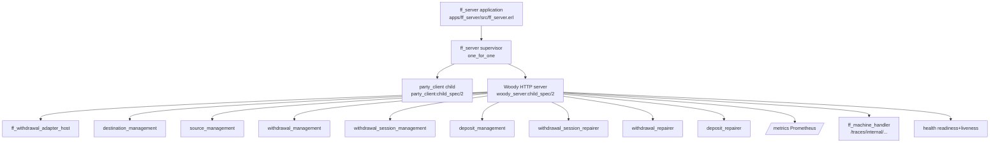

# Architecture

Fistful is a single OTP release (`fistful-server`) composed of an umbrella of
applications. At runtime it boots a Woody/Thrift HTTP server on port `8022`,
loads a set of `machinery` backends, and wires them into `progressor` —
an Erlang framework that stores state‑machine histories in PostgreSQL and
drives machine processing (timeouts, calls, notifications, repairs) from
worker pools.

## Mental model

Every domain entity is an **event‑sourced state machine**. The authoritative
state is the ordered event log; the in‑memory model (the `Model` part of
[`ff_machine:st/1`](../apps/fistful/src/ff_machine.erl#L17)) is a fold of that
log, reconstructed each time the machine is woken. State transitions happen
as a result of three external drivers:

1. **Calls** — synchronous RPCs from clients (`Create`, `GetQuote`,
   `CreateAdjustment`, …).
2. **Timeouts** — the processor decides a machine should advance on its own
   (e.g. push a withdrawal along its activity chain).
3. **Notifications** — another machine or another service reports something
   interesting (e.g. `ff_withdrawal_session_machine` tells
   `ff_withdrawal_machine` that the session finished).

Money is never held or moved inside fistful itself. `shumway` (the Vality
double‑entry accounter) is the book of record; fistful describes *what* it
wants to post via `final_cash_flow` and calls `Hold` / `CommitPlan` /
`RollbackPlan` on that service.

## Supervision tree



The top‑level supervisor is defined in
[ff_server.erl:50](../apps/ff_server/src/ff_server.erl#L50). It starts
exactly two children: a party‑client pool and the Woody server. The Woody
server multiplexes **all** Thrift services, the Prometheus metrics scrape
endpoint, the `ff_machine_handler` JSON trace endpoint, and the readiness /
liveness probes onto one HTTP listener.

The handler list is built from a fixed table
[ff_server.erl:77](../apps/ff_server/src/ff_server.erl#L77) and dispatched to
its service path by [`ff_services:get_service_path/1`](../apps/ff_server/src/ff_services.erl#L46).

## Progressor backends

`progressor` is configured in [config/sys.config:34‑134](../config/sys.config#L34)
with seven namespaces, each pointing at a machinery processor and a
serialization schema:

| Namespace | Handler module | Schema module |
|-----------|----------------|---------------|
| `ff/identity` | `ff_identity_machine` | `ff_identity_machinery_schema` |
| `ff/wallet_v2` | `ff_wallet_machine` | `ff_wallet_machinery_schema` |
| `ff/source_v1` | [`ff_source_machine`](../apps/ff_transfer/src/ff_source_machine.erl) | [`ff_source_machinery_schema`](../apps/ff_server/src/ff_source_machinery_schema.erl) |
| `ff/destination_v2` | [`ff_destination_machine`](../apps/ff_transfer/src/ff_destination_machine.erl) | [`ff_destination_machinery_schema`](../apps/ff_server/src/ff_destination_machinery_schema.erl) |
| `ff/deposit_v1` | [`ff_deposit_machine`](../apps/ff_transfer/src/ff_deposit_machine.erl) | [`ff_deposit_machinery_schema`](../apps/ff_server/src/ff_deposit_machinery_schema.erl) |
| `ff/withdrawal_v2` | [`ff_withdrawal_machine`](../apps/ff_transfer/src/ff_withdrawal_machine.erl) | [`ff_withdrawal_machinery_schema`](../apps/ff_server/src/ff_withdrawal_machinery_schema.erl) |
| `ff/withdrawal/session_v2` | [`ff_withdrawal_session_machine`](../apps/ff_transfer/src/ff_withdrawal_session_machine.erl) | [`ff_withdrawal_session_machinery_schema`](../apps/ff_server/src/ff_withdrawal_session_machinery_schema.erl) |

> [!NOTE]
> The `ff/identity` and `ff/wallet_v2` handler modules are referenced in
> `sys.config` but their `.erl` sources are not present in the current
> working copy. Wallet and party configuration is instead fetched live from
> `party-management` (see [`ff_party`](../apps/fistful/src/ff_party.erl#L57)) and
> the Vality DMT. These legacy namespaces remain configured for backwards
> compatibility.

All project namespaces share one storage pool, `default_pool`, backed by
`prg_pg_backend` pointed at PostgreSQL database `fistful` with user
`fistful` ([sys.config:17‑32](../config/sys.config#L17)). Each namespace gets
its own progressor pool with `worker_pool_size => 100`,
`process_step_timeout => 30`, and a retry policy of up to 3 attempts with
exponential backoff capped at 180 s ([sys.config:43‑53](../config/sys.config#L43)).

The conversion from progressor's configuration maps into machinery backends
happens during `ff_server`'s supervisor init — see
[`get_namespaces_params/0`](../apps/ff_server/src/ff_server.erl#L139) and
[`contruct_backend_childspec/4`](../apps/ff_server/src/ff_server.erl#L150),
which register one backend per namespace under
`application:set_env(fistful, backends, #{...})`. Domain code later resolves
a backend with [`fistful:backend/1`](../apps/fistful/src/fistful.erl#L36).

## Request lifecycle

```mermaid
sequenceDiagram
  autonumber
  participant C as Client
  participant W as woody_server
  participant WR as ff_woody_wrapper
  participant H as ff_*_handler
  participant M as ff_*_machine
  participant D as ff_* (domain)
  participant PG as PostgreSQL / progressor
  participant X as External services

  C->>W: POST /v1/withdrawal (Thrift Create)
  W->>WR: dispatch, attach woody context
  WR->>H: handle_function('Create', Args, Opts)
  H->>H: ff_*_codec:unmarshal_*
  H->>M: create(Params, Ctx)
  M->>D: ff_withdrawal:create(Params)
  D->>X: compute_payment_institution / get_wallet / ...
  D-->>M: [events]
  M->>PG: machinery:start(NS, ID, Args)
  PG-->>M: ok
  M-->>H: ok
  H->>H: Get(ID) -> marshal state
  H-->>WR: {ok, Thrift response}
  WR-->>W: {ok, reply}
  W-->>C: HTTP 200 Thrift body
  Note over PG,M: Later, progressor fires process_timeout;<br/>fistful:process_timeout walks the activity chain
```

The wrapping happens in
[`ff_woody_wrapper`](../apps/ff_server/src/ff_woody_wrapper.erl) — each Thrift
call is handed to `ff_woody_wrapper` with a static options map that contains
the `party_client` pool handle and the default handling timeout. The wrapper
pushes a scoper scope and a [`ff_context`](../apps/fistful/src/ff_context.erl)
with the woody context for downstream RPC calls.

All domain modules use a single error‑propagation idiom: a `do/1` block from
[`ff_pipeline`](../apps/ff_core/src/ff_pipeline.erl) that catches thrown
exceptions and turns them into `{error, Reason}`. Individual handler clauses
then translate each `Reason` into a business Thrift exception via
`woody_error:raise(business, #fistful_*{})` — see the big case in
[`ff_withdrawal_handler`](../apps/ff_server/src/ff_withdrawal_handler.erl#L36).

## Processing model

There is **no Erlang gen_server per entity**. Machines are stateless: on every
event progressor reads the relevant events from PostgreSQL, hands them to
`machinery_prg_backend` → `fistful:process_*/3`, which does the work and
returns a `machinery:result`. Writes (appended events and updated
`aux_state`) land back in PostgreSQL in the same transaction.

Concurrency is controlled by progressor: at most one worker per
`(namespace, id)` runs at a time (serialized with a row lock); worker pools
are sized per namespace (default 100, see
[sys.config:52](../config/sys.config#L52)). Timeouts and retries on errors
are also driven by progressor.

> [!TIP]
> The pull‑based (`process_timeout`) model means a withdrawal doesn't finish
> "instantly" on Create. The create call returns as soon as the initial event
> is persisted; the entity then walks its activity chain asynchronously —
> routing, posting, session, limit check, commit, status — each iteration a
> fresh machinery step. See [state-machines.md](state-machines.md) for the
> activity dispatcher.

## Internal endpoints

In addition to the Thrift services, the HTTP server exposes:

- `GET /metrics/[:registry]` — Prometheus scrape
  ([ff_server.erl:119](../apps/ff_server/src/ff_server.erl#L119)).
- `GET /health/liveness`, `GET /health/readiness` — health checks from
  `erl_health` driven by the `health_check_liveness` and
  `health_check_readiness` maps in
  [sys.config:252‑270](../config/sys.config#L252).
- `GET /traces/internal/{namespace}/:process_id` — a JSON dump of the
  machine's current trace, dispatched by
  [`ff_machine_handler`](../apps/ff_server/src/ff_machine_handler.erl#L7);
  under the hood it calls `ff_machine:trace/2` which in turn goes through
  `machinery:trace/3`. Useful for post‑mortems.

## See also

- [applications.md](applications.md) — what each umbrella app provides.
- [state-machines.md](state-machines.md) — namespace‑by‑namespace.
- [persistence.md](persistence.md) — how events are serialized and stored.
