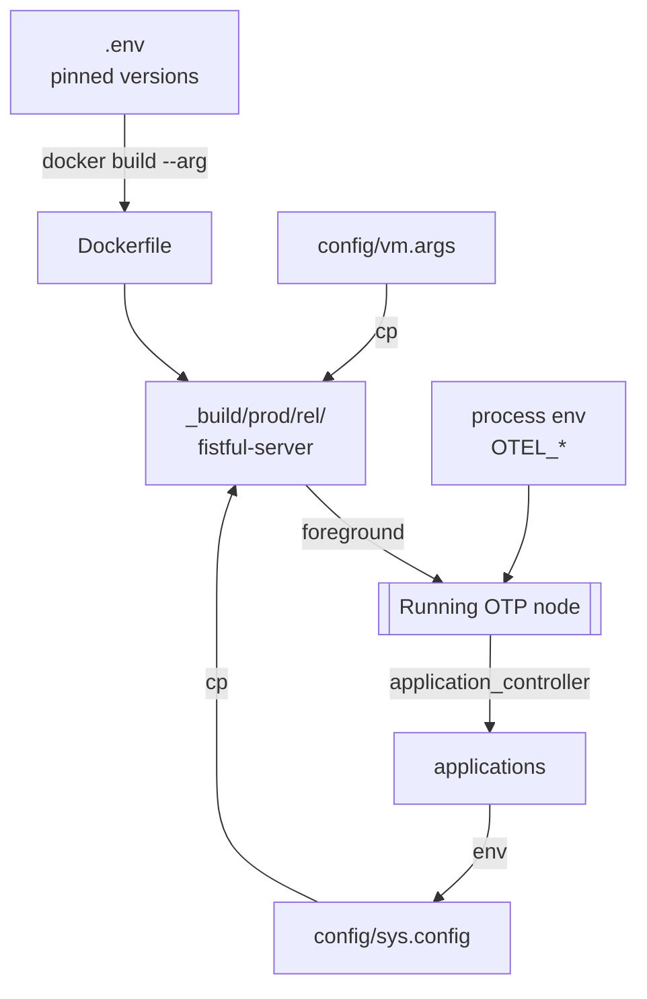

# Configuration

Fistful reads its configuration from four sources:

1. **`.env`** — pinned tool versions, used for Dockerfile builds and
   Makefile targets. See [.env](../.env).
2. **`config/sys.config`** — OTP application environment at release time.
3. **`config/vm.args`** — Erlang VM arguments.
4. **Process environment** (set by docker / the wrapping platform) —
   OpenTelemetry and a few switches.

The whole file `config/sys.config` is baked into the release (see
[rebar.config:103](../rebar.config#L103)), but is replaceable at runtime
by mounting a different `sys.config` over `releases/0.1/sys.config`.

## `.env`

[.env:4‑7](../.env#L4)

```
SERVICE_NAME=fistful-server
OTP_VERSION=27.1.2
REBAR_VERSION=3.24
THRIFT_VERSION=0.14.2.3
```

These are interpolated by the Makefile and Dockerfile. The Thrift
version matters because every dep that ships IDL needs compatible
generated code.

## `config/vm.args`

Defaults for the Erlang VM (node name, cookie, distribution config).

## `config/sys.config`

A flat proplist of `{application, [{key, value}, ...]}` tuples. The
important groups:

### `kernel`

[sys.config:2‑14](../config/sys.config#L2). Configures logger:

- Global level `info`.
- Single handler `default` writing JSON to
  `/var/log/fistful-server/console.json` via
  `logger_logstash_formatter`.
- `sync_mode_qlen => 20` — switches the handler into sync mode once the
  queue grows beyond 20 messages (back‑pressure on log floods).

### `epg_connector`

[sys.config:16‑32](../config/sys.config#L16). PostgreSQL connection pools
used by `prg_pg_backend`:

| Key | Value |
|-----|-------|
| `databases.default_db.host` | `db` |
| `databases.default_db.port` | `5432` |
| `databases.default_db.database` | `fistful` |
| `databases.default_db.username` | `fistful` |
| `databases.default_db.password` | `postgres` |
| `pools.default_pool.database` | `default_db` |
| `pools.default_pool.size` | `10` |

### `progressor`

[sys.config:34‑134](../config/sys.config#L34). See
[persistence.md](persistence.md) for structure. Namespaces and their
associated handler/schema modules are declared here. Each namespace is
registered as a separate progressor pool with `worker_pool_size => 100`.

### `fistful`

[sys.config:199‑218](../config/sys.config#L199).

- `provider` — a map of *legacy* provider aliases (`<<"ncoeps">>`,
  `<<"test">>`) to their `payment_institution_id`, `contract_template_id`,
  and `contractor_level`. Only referenced in legacy identity/claim paths.
- `services` — outbound Woody endpoints:
  - `accounter => "http://shumway:8022/accounter"`
  - `limiter => "http://limiter:8022/v1/limiter"`
  - `validator => "http://validator:8022/v1/validator_personal_data"`
  - `party_config => "http://party-management:8022/v1/processing/partycfg"`

### `ff_transfer`

[sys.config:220‑234](../config/sys.config#L220).

| Key | Meaning |
|-----|---------|
| `max_session_poll_timeout` | Max wait (seconds) between session adapter polls. Default 14400 (4 h). |
| `withdrawal.default_transient_errors` | Failure reason strings treated as retryable for all parties |
| `withdrawal.party_transient_errors` | Per‑party override map of failure reasons → retryable |

### `ff_server`

[sys.config:236‑271](../config/sys.config#L236).

| Key | Default | Notes |
|-----|---------|-------|
| `ip` | `"::"` | Bind address (IPv6 any) |
| `port` | `8022` | HTTP listener |
| `default_woody_handling_timeout` | `30000` | ms; inherited by inbound handlers |
| `net_opts` | `[{timeout, 60000}]` | Keep‑alive timeout bumped to 60 s |
| `scoper_event_handler_options` | — | Log‑formatter size caps |
| `health_check_liveness` | `{disk, memory, service}` | 99% disk usage, 99% cgroup memory, service alive |
| `health_check_readiness` | `{dmt_client, progressor}` | DMT reachable, all progressor NS registered |

### `dmt_client`

[sys.config:140‑162](../config/sys.config#L140).

| Key | Default |
|-----|---------|
| `cache_update_interval` | `5000` ms |
| `max_cache_size` | 20 elements / 50 MiB |
| `service_urls.AuthorManagement` | `http://dmt:8022/v1/domain/author` |
| `service_urls.Repository` | `http://dmt:8022/v1/domain/repository` |
| `service_urls.RepositoryClient` | `http://dmt:8022/v1/domain/repository_client` |

### `party_client`

[sys.config:164‑184](../config/sys.config#L164).

| Key | Default |
|-----|---------|
| `services.party_management` | `http://party_management:8022/v1/processing/partymgmt` |
| `woody.cache_mode` | `safe` (other options: `disabled`, `aggressive`) |

### `bender_client`

[sys.config:186‑197](../config/sys.config#L186).

| Key | Default |
|-----|---------|
| `services.Bender` | `http://bender:8022/v1/bender` |
| `services.Generator` | `http://bender:8022/v1/generator` |
| `deadline` | `60000` ms |

### Miscellaneous

- `scoper` — `{storage, scoper_storage_logger}` (logs scopes instead of
  collecting them) ([sys.config:136](../config/sys.config#L136)).
- `snowflake` — `machine_id` optionally pinned
  ([sys.config:273](../config/sys.config#L273)).
- `prometheus` — `{collectors, [default]}`
  ([sys.config:277](../config/sys.config#L277)).
- `hackney` — `mod_metrics => woody_hackney_prometheus`
  ([sys.config:281](../config/sys.config#L281)).

## Environment variables

### OpenTelemetry

Set only when the tracing overlay compose file is used
([compose.tracing.yaml](../compose.tracing.yaml)):

| Variable | Value |
|----------|-------|
| `OTEL_SERVICE_NAME` | `fistful_testrunner` (for the testrunner container) |
| `OTEL_TRACES_EXPORTER` | `otlp` |
| `OTEL_TRACES_SAMPLER` | `parentbased_always_on` (testrunner) / `parentbased_always_off` (other services) |
| `OTEL_EXPORTER_OTLP_PROTOCOL` | `http_protobuf` |
| `OTEL_EXPORTER_OTLP_ENDPOINT` | `http://jaeger:4318` |

The `opentelemetry`, `opentelemetry_api` and `opentelemetry_exporter`
applications are pulled in as deps
([rebar.config:47‑49](../rebar.config#L47)) and loaded into the release
as `temporary` (release layout at
[rebar.config:95](../rebar.config#L95)).

### Docker build args

Passed to the Dockerfile by
[Makefile](../Makefile):

| Variable | Source |
|----------|--------|
| `OTP_VERSION`, `REBAR_VERSION`, `THRIFT_VERSION` | `.env` |
| `SERVICE_NAME` | `.env` |
| `TARGETARCH` | docker buildx |
| `USER_UID` / `USER_GID` | `1001` (default in Dockerfile) |

## Fistful's own reads

Code that queries its own application env (pattern:
`genlib_app:env(ff_*, Key, Default)`):

| Location | Key |
|----------|-----|
| [`ff_server:init/1`](../apps/ff_server/src/ff_server.erl#L52) | `ff_server.{ip, port, woody_opts, default_woody_handling_timeout, health_check_*}` |
| [`fistful:backend/1`](../apps/fistful/src/fistful.erl#L36) | `fistful.backends` (set by `ff_server`) |
| [`ff_withdrawal_session_machine`](../apps/ff_transfer/src/ff_withdrawal_session_machine.erl) | `ff_transfer.max_session_poll_timeout`, `withdrawal.default_transient_errors`, etc. |

## Putting it together


