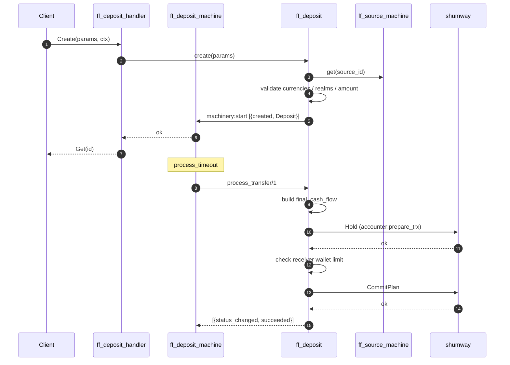
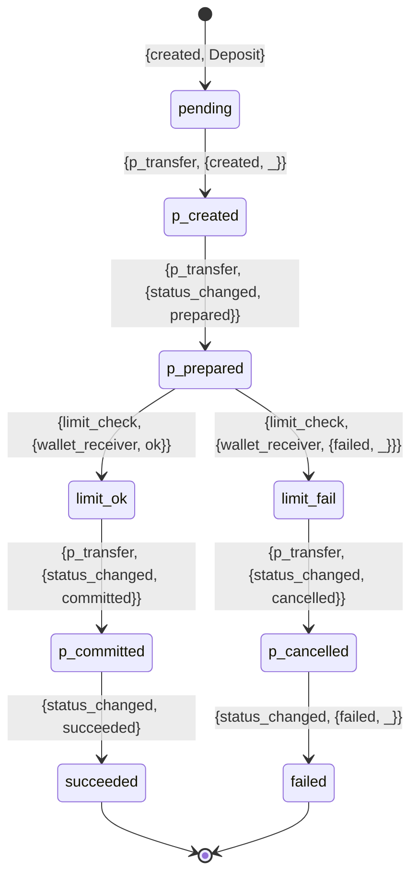

# Deposit Flow

A deposit moves money **into** a wallet from a source. It is the
simpler counterpart of a withdrawal — no routing, no provider adapter, no
sessions, no callbacks. Just a double‑entry posting transfer with an
optional limit check.

## Mental model

Source → wallet transfer via shumway. The deposit machine records the
intent and drives the posting transfer to commit (or compensates with a
rollback on failure). There is no external communication beyond the
accounter (`shumway`) and, if the wallet has a configured limit, a
balance check.

## Sequence

## State transitions

## Step detail

### 1. Create

Entry: [`ff_deposit_handler:handle_function('Create', ...)`](../apps/ff_server/src/ff_deposit_handler.erl#L30).

[`ff_deposit:create/1`](../apps/ff_transfer/src/ff_deposit.erl) runs inside
a `ff_pipeline:do/1`:

1. Fetch source via `ff_source_machine:get/1`.
2. Fetch party + wallet via `ff_party`.
3. Validate the wallet is accessible (not blocked/suspended).
4. Validate that source currency = wallet currency = deposit body currency.
5. Validate source and wallet realms match.
6. `ff_party:validate_deposit_creation/2` — enforces cash policies from
   the wallet's terms (allowed currency, bad amount, etc.).
7. Emit `[{created, Deposit}]`.

Possible errors — see
[`ff_deposit:create_error/0`](../apps/ff_transfer/src/ff_deposit.erl#L75):

- `{source, notfound | unauthorized}`
- `{wallet, notfound}`
- `{party, notfound}`
- `ff_party:validate_deposit_creation_error()` — `{currency_validation, _}`
  or `{bad_deposit_amount, Cash}`
- `{inconsistent_currency, {Deposit, Source, Wallet}}`
- `{realms_mismatch, {SourceRealm, WalletRealm}}`

### 2. Posting transfer

`process_transfer/1` dispatches to:

1. **p_transfer_start** — `ff_deposit` builds a cash flow with postings:
   - `{wallet, sender_source}` → `{wallet, receiver_settlement}` for the
     principal amount.
   - Optional system/subagent postings for fees (deposits typically have
     none; check domain config).
2. **p_transfer_prepare** — `ff_postings_transfer:prepare/1` calls
   `shumway:Hold`.
3. **limit_check** — applies only the receiver side:
   `{limit_check, {wallet_receiver, ok | {failed, _}}}`. Failure here
   means the wallet's balance after receiving would overflow its
   configured upper bound.
4. **p_transfer_commit** or **p_transfer_cancel** — depending on limit
   outcome.
5. **finish** — `{status_changed, succeeded}` or `{status_changed, {failed, _}}`.

### 3. Negative deposits

A deposit created with a *negative* body (an `ff_accounting:body()` whose
amount is negative) is flagged as
[`is_negative`](../apps/ff_transfer/src/ff_deposit.erl#L99). Functionally
this inverts the cash flow: money flows from wallet **back** into the
source. This is used for corrections and manual reversals without creating
a true withdrawal.

## Thrift handler surface

`fistful_deposit_thrift:'Management'` — four RPCs:

| RPC | Module | Purpose |
|-----|--------|---------|
| `Create` | [`ff_deposit_handler`](../apps/ff_server/src/ff_deposit_handler.erl#L30) | Create & persist |
| `Get` | [`ff_deposit_handler`](../apps/ff_server/src/ff_deposit_handler.erl#L68) | Current state |
| `GetContext` | [`ff_deposit_handler`](../apps/ff_server/src/ff_deposit_handler.erl#L79) | Stored `ff_entity_context` |
| `GetEvents` | [`ff_deposit_handler`](../apps/ff_server/src/ff_deposit_handler.erl#L88) | Raw event stream |

There's also `fistful_deposit_thrift:'Repairer'`:`Repair` served by
[`ff_deposit_repair`](../apps/ff_server/src/ff_deposit_repair.erl).

## Idempotence

The deposit ID is the machine ID — a second `Create` with the same ID is
a no‑op. The posting transfer ID is the deposit ID, so shumway
deduplicates there as well.

> [!NOTE]
> Unlike withdrawals, deposits do **not** use the external `limiter`
> service — there are no turnover limits on receiving money into a wallet.
> Only the wallet's own cash‑range terms are enforced via
> `ff_party:validate_wallet_limits/2`.
