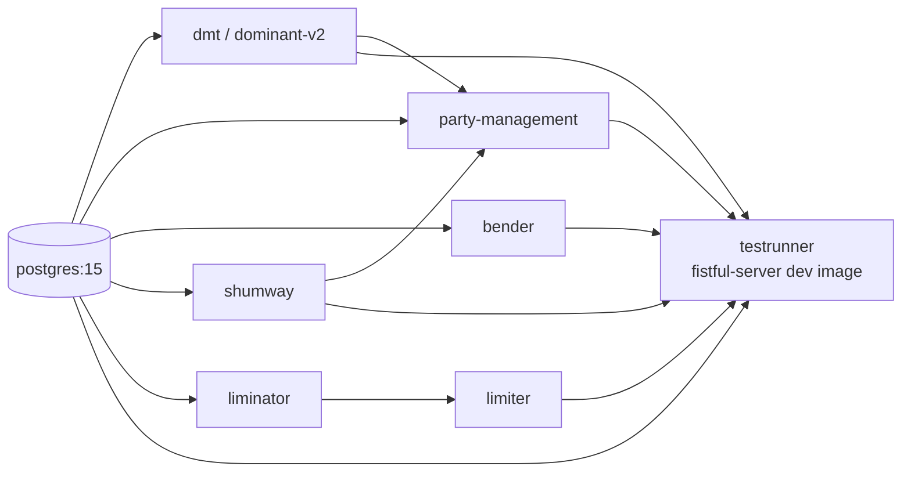

# Development

Fistful is built with `rebar3` and ships a production release via
`rebar3 as prod release`. Most day‑to‑day tasks are wrapped in the
[Makefile](../Makefile), which has two modes:

1. **Local** — run `rebar3` directly on the host (`make compile`,
   `make eunit`, `rebar3 shell`).
2. **Containerised** — `wc-%` targets run the task in a dev image;
   `wdeps-%` targets bring the full dependency compose stack up first.

## Toolchain versions

Pinned in [.env](../.env):

| Tool | Version |
|------|---------|
| Erlang/OTP | `27.1.2` |
| rebar3 | `3.24` |
| Thrift (Vality fork) | `0.14.2.3` |

`rebar.config` uses `debug_info`, `warnings_as_errors`, and an extensive
warning set — treat every warning as a compile break (see
[rebar.config:2‑25](../rebar.config#L2)).

## Project layout

Umbrella project with apps in `apps/`. See
[applications.md](applications.md) for the app breakdown and
[rebar.config:69](../rebar.config#L69) for the list.

```
fistful-server/
├── apps/                 # OTP umbrella
│   ├── ff_core/          # Pure utilities
│   ├── fistful/          # Domain core
│   ├── ff_transfer/      # Transfer processes
│   ├── ff_server/        # I/O, handlers, release app
│   ├── ff_validator/     # Personal-data validator wrapper
│   ├── machinery_extra/  # Optional machinery backends
│   └── ff_cth/           # Common-test helpers
├── config/               # sys.config + vm.args
├── test/                 # CT env config (DB, DMT, bender, party)
├── compose.yaml          # Dev stack
├── compose.tracing.yaml  # Tracing overlay
├── Dockerfile            # Prod image (multi-stage)
├── Dockerfile.dev        # Dev image for CI + local containerised tests
├── Makefile              # Task runner
├── rebar.config          # Build + deps
└── elvis.config          # Lint rules (erlang-elvis)
```

## Common tasks

All of these live in the [Makefile](../Makefile):

| Target | Description |
|--------|-------------|
| `make compile` | `rebar3 compile` |
| `make xref` | Cross‑reference check |
| `make lint` | Run `rebar3 lint` (elvis rules in [elvis.config](../elvis.config)) |
| `make check-format` | `rebar3 fmt -c` (erlfmt, 120‑column) |
| `make format` | `rebar3 fmt -w` (auto‑fix) |
| `make dialyze` | `rebar3 as test dialyzer` (test profile adds `eunit`, `common_test`, `meck`, `jose` to the PLT) |
| `make static-check` | `check-format` + `lint` + `xref` + `dialyze` |
| `make eunit` | Unit tests with coverage |
| `make common-test` | All CT suites |
| `make common-test.<SUITE>` | One suite, optional `CT_CASE=<case>` |
| `make test` | `eunit` + `common-test` |
| `make cover` / `make cover-report` | Coverage aggregation |
| `make release` | `rebar3 as prod release` |
| `make clean` / `make distclean` | Clean build artifacts |

> [!TIP]
> The user CLAUDE.md convention is: after edits, run `make check` or
> `make lint`, then `rebar3 as test dialyzer`, and verify both pass
> before declaring done. There's no `make check` target — the closest
> equivalent is `make static-check`.

## Container‑based workflow

The `wc-*` (workspace‑container) and `wdeps-*` (workspace‑with‑deps)
prefix targets run make inside a dev image.

| Target | What it does |
|--------|--------------|
| `make dev-image` | Build the `Dockerfile.dev` image (cached in `.image.dev`) |
| `make wc-shell` | Interactive shell inside the dev image |
| `make wc-<target>` | e.g. `make wc-dialyze` — run `dialyze` inside the container |
| `make wdeps-shell` | `compose up` the full stack + interactive shell |
| `make wdeps-<target>` | e.g. `make wdeps-common-test` — run a target against live dependencies |
| `make wdeps-common-test.<SUITE>` | Run one CT suite inside the stack |

The containerised path is what CI uses, so reproducing a failure
locally is `make wdeps-common-test.<SUITE> CT_CASE=<case>`.

## Running the compose stack manually



[compose.yaml](../compose.yaml) brings everything up with healthchecks
gating dependencies. `compose.yaml:14‑27` has the explicit
`depends_on` matrix — the `testrunner` waits on `db`, `dmt`,
`party-management`, `limiter`, `shumway`, and `bender`. The
[compose.tracing.yaml](../compose.tracing.yaml) overlay adds a Jaeger
all‑in‑one container and sets OpenTelemetry env vars on every service.

## REPL

A local shell that doesn't talk to any dependencies:

```
make rebar-shell        # rebar3 shell (runs ff_server as a library)
```

For an interactive shell *inside* a running stack, use
`make wdeps-shell` — this gives you `rebar3 shell` in the `testrunner`
container with all deps reachable on the docker network.

## Test suites

Common Test suites live next to the app under test:

- [apps/ff_transfer/test/](../apps/ff_transfer/test/) — domain‑level
  suites (`ff_withdrawal_SUITE`, `ff_withdrawal_adjustment_SUITE`,
  `ff_withdrawal_limits_SUITE`, `ff_withdrawal_routing_SUITE`,
  `ff_deposit_SUITE`, `ff_source_SUITE`, `ff_destination_SUITE`,
  `ff_transfer_SUITE`).
- [apps/ff_server/test/](../apps/ff_server/test/) — RPC‑level
  integration (`ff_withdrawal_handler_SUITE`,
  `ff_deposit_handler_SUITE`, `ff_source_handler_SUITE`,
  `ff_destination_handler_SUITE`, `ff_withdrawal_session_repair_SUITE`).
- [apps/fistful/test/](../apps/fistful/test/) — unit‑level
  (`ff_limit_SUITE`, `ff_routing_rule_SUITE`).

Suites use the helpers in [apps/ff_cth](../apps/ff_cth/) — see
[ct_helper](../apps/ff_cth/src/ct_helper.erl) for `cfg/2,3`,
`start_apps/1`, `await/2,3`, and the `ct_domain` / `ct_objects` /
`ct_domain_config` fixtures for setting up a test domain state in DMT.

> [!TIP]
> A single case: `make common-test.ff_withdrawal_SUITE CT_CASE=my_case`.
> A single suite: `make common-test.ff_withdrawal_SUITE`.

## Release

[Makefile:88‑89](../Makefile#L88) calls `rebar3 as prod release`. The
`prod` profile is declared in [rebar.config:81‑108](../rebar.config#L81):

- Adds `recon` and `logger_logstash_formatter`.
- Release name `fistful-server` version `0.1`.
- Apps loaded: `runtime_tools`, `tools`, `recon`, `opentelemetry`
  (temporary), `logger_logstash_formatter`, `canal` (both `load`), plus
  the full OTP set (`sasl`, `prometheus*`) and `ff_server`.
- `mode => minimal` keeps the release small.
- `extended_start_script => true` enables the usual `foreground`,
  `console`, `remote_console`, `ping` commands.

The Dockerfile uses a two‑stage build with `erlang:27.1.2` for the
builder and `erlang:27.1.2-slim` for the runtime image — final image
runs as UID 1001, ENTRYPOINT starts the release in `foreground` mode,
and exposes `:8022`.

## Linting

- **erlfmt** — `rebar3 fmt`. Print width 120.
- **rebar3_lint** (elvis) — rules in [elvis.config](../elvis.config).
- **xref** — checks for undefined function calls, deprecated calls,
  etc. ([rebar.config:52](../rebar.config#L52)).
- **dialyzer** — `unmatched_returns`, `error_handling`, `unknown`
  warnings enabled on all deps
  ([rebar.config:59‑67](../rebar.config#L59)).

All of these run in CI (via `make static-check`) and are treated as
gates.
