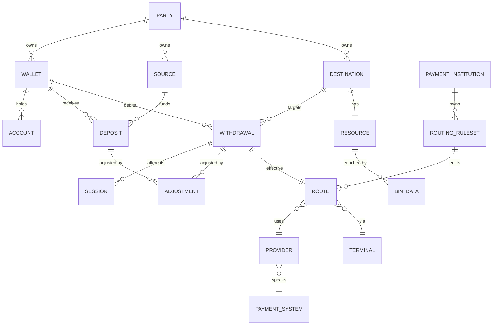

# Domain Model

Fistful orchestrates money movement between **wallets** (balances a party
holds with fistful) and external **sources**/**destinations** (bank cards,
crypto wallets, digital wallets, generic rails). The two money‑moving
primitives are **deposit** (external → wallet) and **withdrawal** (wallet →
external). A withdrawal may spawn one or more **sessions**, each
representing an attempt through a specific provider/terminal. Already
finalized transfers can be corrected through **adjustments**.

## Entity map



The `PARTY`, `WALLET`, `PAYMENT_INSTITUTION`, `PROVIDER`, `TERMINAL`,
`ROUTING_RULESET`, and `PAYMENT_SYSTEM` boxes live in external systems
(`party-management` and Vality DMT). The other entities are local to
fistful and persisted as event streams.

## Party and wallet

| Field | Type | Source |
|-------|------|--------|
| id (party) | [`dmsl_base_thrift:'ID'()`](../apps/fistful/src/ff_party.erl#L14) | party‑management |
| wallet | [`dmsl_domain_thrift:'WalletConfig'()`](../apps/fistful/src/ff_party.erl#L17) | party‑management |
| terms | [`dmsl_domain_thrift:'TermSet'()`](../apps/fistful/src/ff_party.erl#L17) | DMT (via party‑management) |

Parties and wallets are **not** machines in this service — fistful fetches
them on demand through
[`ff_party:get_party/1`](../apps/fistful/src/ff_party.erl#L57) and
[`ff_party:get_wallet/2,3`](../apps/fistful/src/ff_party.erl#L60) and uses
them to compute applicable terms, allowed currencies, cash ranges, and so
on. Accessibility is checked up front; a wallet in `blocked` or `suspended`
state causes `{wallet, {inaccessible, blocked | suspended}}`. See
[`ff_party:inaccessibility/0`](../apps/fistful/src/ff_party.erl#L52).

A wallet has a primary settlement account (retrieved via
[`ff_party:get_wallet_account/1`](../apps/fistful/src/ff_party.erl#L64)) — this
is where deposits credit and withdrawals debit.

## Source (`ff_source`)

An external funding entity (a bank card, a generic resource) that can
originate deposits. Persisted in namespace `ff/source_v1`.

```erlang
-type source() :: #{
    version   := pos_integer(),
    id        := binary(),
    name      := binary(),
    party_id  := ff_party:id(),
    resource  := ff_resource:resource(),
    realm     := ff_payment_institution:realm(),
    ...
}.
```

Sources are lightweight — their machine only records creation and an
authorization step; there is no active processing. See
[`ff_source`](../apps/ff_transfer/src/ff_source.erl) and
[`ff_source_machine`](../apps/ff_transfer/src/ff_source_machine.erl).

## Destination (`ff_destination`)

An external payout target. Persisted in namespace `ff/destination_v2`.
Structurally similar to sources but has an `auth_data` slot for one‑time
push tokens when the destination is a tokenised resource (see
[`ff_destination:auth_data`](../apps/ff_transfer/src/ff_destination.erl)).

## Resource (`ff_resource`)

The typed value inside a source or destination.
[`ff_resource:resource/0`](../apps/fistful/src/ff_resource.erl) is a tagged
union:

- `{bank_card, resource_bank_card()}` — includes BIN data enriched by
  [`ff_bin_data`](../apps/fistful/src/ff_bin_data.erl) (payment system,
  card type, issuer country).
- `{crypto_wallet, resource_crypto_wallet()}` — address + currency.
- `{digital_wallet, resource_digital_wallet()}` — e.g. a wallet at a
  specific provider.
- `{generic, resource_generic()}` — opaque binary payload for provider‑
  defined schemas.

A `resource_descriptor` is a compact reference (e.g.
`{bank_card, bin_data_id()}`) used in withdrawal quotes for replay.

## Cash and cash flow

- [`ff_cash:cash()`](../apps/fistful/src/ff_cash.erl) — `{Amount, CurrencyID}`,
  where `Amount :: integer()` is in minor units.
- [`ff_cash_flow:plan_account/0`](../apps/fistful/src/ff_cash_flow.erl#L73) —
  one of:
  - `{wallet, sender_source|sender_settlement|receiver_settlement|receiver_destination}`
  - `{system, settlement|subagent}`
  - `{provider, settlement}`
- A **plan** cash flow ([`cash_flow_plan`](../apps/fistful/src/ff_cash_flow.erl#L46))
  is a template of postings with symbolic volumes (`{fixed, Cash}`,
  `{share, {Ratio, operation_amount, Rounding}}`, `{product, min/max_of}`).
- [`ff_cash_flow:finalize/3`](../apps/fistful/src/ff_cash_flow.erl#L9) resolves
  plan accounts to real account IDs and plan volumes to concrete amounts —
  the resulting `final_cash_flow` is what postings transfers commit.

## Fees

[`ff_fees_plan`](../apps/fistful/src/ff_fees_plan.erl) is a map of plan
constants → plan volumes (`operation_amount`, `surplus`, etc.). It's
evaluated into a [`ff_fees_final`](../apps/fistful/src/ff_fees_final.erl)
against a concrete cash; the final fees are then folded into the cash flow
via [`ff_cash_flow:add_fee/2`](../apps/fistful/src/ff_cash_flow.erl#L10).

## Payment institution, provider, terminal

From the Vality domain (DMT). Fetched and reduced via
[`ff_payment_institution`](../apps/fistful/src/ff_payment_institution.erl),
[`ff_payouts_provider`](../apps/fistful/src/ff_payouts_provider.erl) and
[`ff_payouts_terminal`](../apps/fistful/src/ff_payouts_terminal.erl). A
payment institution has a **realm** (`test` or `live`) that's propagated to
accounts and checked against wallet/destination compatibility — see the
`{realms_mismatch, {_, _}}` errors in
[`ff_withdrawal:create_error/0`](../apps/ff_transfer/src/ff_withdrawal.erl#L93)
and [`ff_deposit:create_error/0`](../apps/ff_transfer/src/ff_deposit.erl#L75).

## Route

A choice of `(provider_id, terminal_id)` for a single withdrawal attempt.
Defined in [`ff_withdrawal_routing:route/0`](../apps/ff_transfer/src/ff_withdrawal_routing.erl#L22):

```erlang
-type route() :: #{
    version := 1,
    provider_id := pos_integer(),
    terminal_id := pos_integer(),
    provider_id_legacy => pos_integer()
}.
```

Routes are produced by
[`ff_withdrawal_routing:prepare_routes/3`](../apps/ff_transfer/src/ff_withdrawal_routing.erl#L77)
after
[`ff_routing_rule:gather_routes/4`](../apps/fistful/src/ff_routing_rule.erl)
evaluates the payment institution's routing rulesets (policies applied then
prohibitions subtracted). See [routing.md](routing.md) for the full story.

## Deposit (`ff_deposit`)

Source → wallet credit. Single posting transfer, no sessions, no routing.
See [deposit-flow.md](deposit-flow.md).

Status progression: `pending → succeeded | {failed, failure()}`
([`ff_deposit:status/0`](../apps/ff_transfer/src/ff_deposit.erl#L52)).

A deposit can carry a `negative_body` flag
([`ff_deposit:is_negative/1`](../apps/ff_transfer/src/ff_deposit.erl#L99)) —
used for refunds/corrections that credit the source.

## Withdrawal (`ff_withdrawal`)

Wallet → destination debit. Involves routing, limits, a posting transfer,
zero or more sessions, and optionally adjustments. See
[withdrawal-flow.md](withdrawal-flow.md).

Status progression: `pending → succeeded | {failed, failure()}`
([`ff_withdrawal:status/0`](../apps/ff_transfer/src/ff_withdrawal.erl#L55)).

## Session (`ff_withdrawal_session`)

A single attempt to push a withdrawal through a provider. Stored in its
own namespace `ff/withdrawal/session_v2`. Carries adapter state between
invocations, handles callbacks tagged via
[`ff_machine_tag`](../apps/fistful/src/ff_machine_tag.erl), and emits a
`session_result` back to the owning withdrawal.

```erlang
-type status() :: active | {finished, success | {failed, failure()}}
-type session_result() :: success | {success, transaction_info()} | {failed, failure()}
```

([`ff_withdrawal_session`](../apps/ff_transfer/src/ff_withdrawal_session.erl#L59).)

A withdrawal may run through several sessions (one per attempt/route) —
see [`ff_withdrawal_route_attempt_utils`](../apps/ff_transfer/src/ff_withdrawal_route_attempt_utils.erl).

## Adjustment (`ff_adjustment`)

A corrective operation on an already‑finished withdrawal or deposit. It can
either change the status or replay the cash flow against a newer domain
revision. See [adjustments.md](adjustments.md).

## Entity context

Every machine has an associated `ctx :: ff_entity_context:context()` —
a map keyed by an arbitrary namespace, holding opaque JSON‑ish metadata.
Clients use this to stash their own bookkeeping (e.g. idempotency keys,
external IDs, display names) without touching fistful's own schema. See
[`ff_entity_context`](../apps/fistful/src/ff_entity_context.erl).

## Summary of event shapes

| Entity | Event type (first field) | File |
|--------|--------------------------|------|
| Source | `{created, source()}`, `{auth_data_changed, ...}` | [ff_source.erl](../apps/ff_transfer/src/ff_source.erl) |
| Destination | `{created, destination()}`, `{auth_data_changed, ...}` | [ff_destination.erl](../apps/ff_transfer/src/ff_destination.erl) |
| Deposit | `{created, ...}`, `{limit_check, ...}`, `{p_transfer, ...}`, `{status_changed, ...}` | [ff_deposit.erl:57](../apps/ff_transfer/src/ff_deposit.erl#L57) |
| Withdrawal | `{created, ...}`, `{resource_got, ...}`, `{route_changed, ...}`, `{p_transfer, ...}`, `{limit_check, ...}`, `{validation, ...}`, `{session_started, ...}`, `{session_finished, ...}`, `{status_changed, ...}`, `wrapped_adjustment_event()` | [ff_withdrawal.erl:81](../apps/ff_transfer/src/ff_withdrawal.erl#L81) |
| Session | `{created, ...}`, `{next_state, ...}`, `{transaction_bound, ...}`, `{finished, ...}`, `wrapped_callback_event()` | [ff_withdrawal_session.erl:63](../apps/ff_transfer/src/ff_withdrawal_session.erl#L63) |
| Adjustment | produced inside `wrapped_adjustment_event()` | [ff_adjustment.erl](../apps/ff_transfer/src/ff_adjustment.erl) |

Every event is actually wrapped in a `{ev, Timestamp, Event}` tuple by
[`ff_machine:emit_event/1`](../apps/fistful/src/ff_machine.erl#L63) before
it hits the log.
