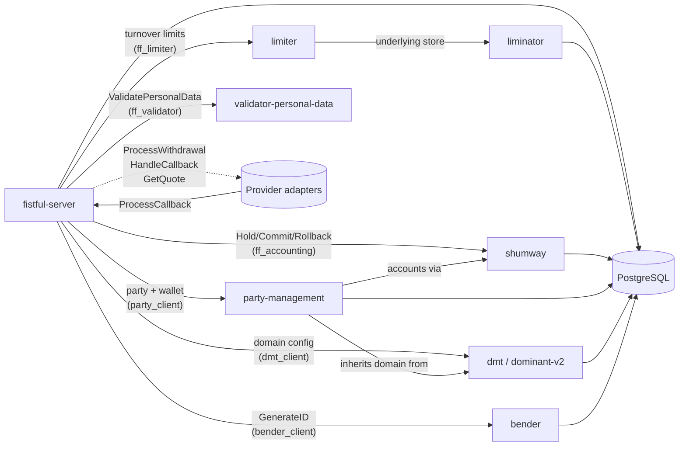

# External Services

Fistful is a coordinator, not a source of truth. It depends on six
external services — all Vality open‑source components reachable over
Woody/Thrift — plus pluggable **provider adapters** for actual money
movement.



## DMT — Vality domain config

- **Repo**: [dominant-v2](https://github.com/valitydev/dominant-v2).
- **Thrift service**: `dmsl_domain_conf_v2_thrift:'Repository'`,
  `'RepositoryClient'`, `'AuthorManagement'`.
- **Erlang client**: `dmt_client` (bundled into the release at
  [rebar.config:39](../rebar.config#L39)).
- **Endpoints used**: configured in
  [sys.config:157‑161](../config/sys.config#L157) —
  `AuthorManagement`, `Repository`, `RepositoryClient` all at
  `http://dmt:8022/v1/domain/...`.

DMT holds every domain object fistful reads:

- Payment institutions (`PaymentInstitution`, `PaymentInstitutionRef`).
- Routing rulesets (`RoutingRuleset`).
- Providers (`Provider`, `ProviderRef`) with their `WithdrawalProvisionTerms`.
- Terminals (`Terminal`, `TerminalRef`).
- Currencies, payment systems, payment methods.
- Wallet configs (`WalletConfig`) — bridged through party‑management.

Accessed via [`ff_domain_config:object/1,2`](../apps/fistful/src/ff_domain_config.erl)
(thin wrapper around `dmt_client`) and revision helpers
[`head/0`](../apps/fistful/src/ff_domain_config.erl).

The `dmt_client` health check is bound into readiness at
[sys.config:258](../config/sys.config#L258).

## party-management

- **Repo**: [party-management](https://github.com/valitydev/party-management).
- **Thrift service**: `dmsl_payproc_thrift:'PartyManagement'`.
- **Erlang client**: `party_client` ([rebar.config:42](../rebar.config#L42))
  using a `safe` cache mode
  ([sys.config:170](../config/sys.config#L170)).
- **Endpoint**: `http://party_management:8022/v1/processing/partymgmt`
  ([sys.config:166](../config/sys.config#L166)).

Authoritative for every party and wallet. Fistful fetches:

- Party existence and revision
  ([`ff_party:get_party/1`](../apps/fistful/src/ff_party.erl#L57)).
- Wallet configs ([`ff_party:get_wallet/2,3`](../apps/fistful/src/ff_party.erl#L60)).
- Effective term sets ([`ff_party:get_terms/3`](../apps/fistful/src/ff_party.erl#L73)).
- Computed routing rulesets
  ([`ff_party:compute_routing_ruleset/3`](../apps/fistful/src/ff_party.erl#L75)).
- Computed provider/terminal terms
  ([`ff_party:compute_provider_terminal_terms/4`](../apps/fistful/src/ff_party.erl#L76)).

## shumway — double‑entry accounter

- **Repo**: [shumway](https://github.com/valitydev/shumway) (Spring Boot,
  Java).
- **Thrift service**: `dmsl_accounter_thrift:'Accounter'`.
- **Endpoint**: `http://shumway:8022/accounter`
  ([sys.config:213](../config/sys.config#L213)).

Called by [`ff_accounting`](../apps/fistful/src/ff_accounting.erl):

| RPC | Purpose |
|-----|---------|
| `CreateAccount` | Called if an account doesn't exist (rare — accounts are usually provisioned by party‑management) |
| `GetAccountByID` | Balance lookups |
| `Hold` | Reserve funds (prepare a posting plan) |
| `CommitPlan` | Apply a previously held plan |
| `RollbackPlan` | Release a held plan |

Idempotency is keyed by the plan ID (`ff_accounting:id()`) fistful
supplies — identical IDs across retries are deduped by shumway.

## limiter + liminator — turnover limits

- **Repos**: [limiter](https://github.com/valitydev/limiter),
  [liminator](https://github.com/valitydev/liminator) (underlying
  counter store).
- **Thrift service**: `limproto_limiter_thrift:'LimiterService'` (proto
  at `limiter_proto`).
- **Endpoint**: `http://limiter:8022/v1/limiter`
  ([sys.config:214](../config/sys.config#L214)).

Called by [`ff_limiter`](../apps/ff_transfer/src/ff_limiter.erl):

| Operation | RPC | Fistful entry |
|-----------|-----|---------------|
| Read limit values | `GetValues` | [`check_limits/4`](../apps/ff_transfer/src/ff_limiter.erl#L39) |
| Hold capacity | `Hold` | [`hold_withdrawal_limits/4`](../apps/ff_transfer/src/ff_limiter.erl#L27) |
| Commit capacity | `Commit` | [`commit_withdrawal_limits/4`](../apps/ff_transfer/src/ff_limiter.erl#L28) |
| Rollback | `Rollback` | [`rollback_withdrawal_limits/4`](../apps/ff_transfer/src/ff_limiter.erl#L29) |

Used only on the withdrawal path.

## bender — ID generation

- **Repo**: [bender](https://github.com/valitydev/bender).
- **Thrift services**: `Bender` and `Generator` (separate schemas).
- **Erlang client**: `bender_client`
  ([rebar.config:43](../rebar.config#L43)).
- **Endpoints**:
  - `http://bender:8022/v1/bender` ([sys.config:188](../config/sys.config#L188))
  - `http://bender:8022/v1/generator` ([sys.config:189](../config/sys.config#L189))

bender gives fistful **idempotent ID generation**: given an external
correlation key, it returns a stable internal ID. Used by upstream APIs
(e.g. wAPI / anapi) more than by fistful itself; from fistful's
perspective IDs are handed in by the client as part of each `Create`
payload.

## validator-personal-data

- **Repo**:
  [validator-personal-data](https://github.com/valitydev/validator-personal-data).
- **Thrift service**:
  `validator_personal_data_validator_personal_data_thrift:'ValidatorPersonalDataService'`.
- **Endpoint**: `http://validator:8022/v1/validator_personal_data`
  ([sys.config:215](../config/sys.config#L215)).

Called by [`ff_validator:validate_personal_data/1`](../apps/ff_validator/src/ff_validator.erl#L18)
— the withdrawal sender/receiver contact info is checked against a
personal‑data token. Result is stored on the withdrawal as
`{validation, {sender | receiver, {personal, ...}}}` event.

## Provider adapters (pluggable)

Adapters are *not* part of the fistful release — they are separate
processes that fistful calls outbound for each withdrawal session.

- **Thrift services**: `dmsl_wthd_provider_thrift:'Adapter'` (outbound,
  fistful → adapter), `'AdapterHost'` (inbound, adapter → fistful).
- **Endpoint**: per‑provider, configured in DMT as part of each
  `Provider` object's proxy definition.
- **Fistful side**:
  [`ff_adapter_withdrawal`](../apps/ff_transfer/src/ff_adapter_withdrawal.erl)
  for outbound calls,
  [`ff_withdrawal_adapter_host`](../apps/ff_server/src/ff_withdrawal_adapter_host.erl)
  at `/v1/ff_withdrawal_adapter_host` for inbound callbacks.

See [adapter-integration.md](adapter-integration.md) for the protocol.

## Shared database

Every service named above (except the adapters) runs against the same
PostgreSQL instance in the compose stack; each owns a distinct database.
[compose.yaml:134](../compose.yaml#L134):

```
POSTGRES_MULTIPLE_DATABASES: "fistful,bender,dmt,party_management,shumway,liminator"
```

The init scripts under
[test/postgres/docker-entrypoint-initdb.d/](../test/postgres/) create
each user and database.

> [!NOTE]
> In production deployments these services typically have their own
> managed PostgreSQL instances — the single‑db compose file is a local
> convenience only.
