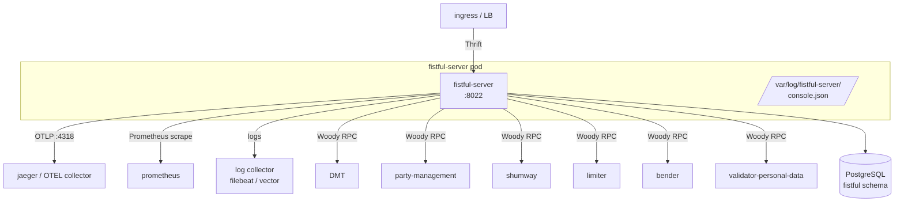

# Operations

This document covers what running fistful in production looks like:
container image, release artifacts, health model, and the repair
vocabulary used to unstick broken machines.

## Release image

Built by [Dockerfile](../Dockerfile). Two stages:

1. **Builder** — `erlang:27.1.2` with the Vality thrift compiler
   installed, runs `rebar3 compile && rebar3 as prod release`.
2. **Runtime** — `erlang:27.1.2-slim` with:
   - `/opt/fistful-server/` — release tree, owned by UID 1001.
   - `/var/log/fistful-server/` — log directory.
   - `/entrypoint.sh` — invokes `/opt/fistful-server/bin/fistful-server foreground`.
   - Exposes `:8022`.

Released via `rebar3 as prod release`; see the prod profile at
[rebar.config:81‑108](../rebar.config#L81). `mode => minimal` and
`extended_start_script => true` are set, so the standard release
commands (`console`, `foreground`, `ping`, `remote_console`,
`rpc`, `attach`) are all available from
`bin/fistful-server`.

## Runtime topology



- The HTTP listener on `:8022` serves Thrift RPCs, the Prometheus
  scrape endpoint, the health probes, and the internal trace dump. Lock
  this port down to trusted callers — there is no authentication
  except whatever the ingress enforces.
- Logs are written to `/var/log/fistful-server/console.json` (JSON /
  logstash format). Mount or tail this to your log collector.
- If OTEL env vars are set, traces are pushed to the configured OTLP
  endpoint.

## Health model

Two endpoints, independently significant:

| Endpoint | What it checks | Suggested use |
|----------|----------------|---------------|
| `GET /health/liveness` | disk < 99% full, cgroup memory < 99%, service registered | Kubernetes livenessProbe |
| `GET /health/readiness` | `dmt_client:health_check/0`, `progressor:health_check/[namespaces]` | Kubernetes readinessProbe |

Configured in [sys.config:252‑270](../config/sys.config#L252). Both
check specs go through
[`ff_server:enable_health_logging/1`](../apps/ff_server/src/ff_server.erl#L114),
so transitions between healthy and unhealthy are also logged.

Readiness covers:

- DMT reachability — if DMT is down, fistful will misroute; returning
  unready keeps traffic off the pod.
- Progressor namespaces — `ff/source_v1`, `ff/destination_v2`,
  `ff/deposit_v1`, `ff/withdrawal_v2`, `ff/withdrawal/session_v2`.

> [!WARNING]
> The readiness probe does **not** check `party-management`, `shumway`,
> `limiter`, `bender`, or `validator`. A failing dependency will manifest
> as business‑error responses, not readiness flips.

## Scaling

Fistful is stateless in the sense that all durable state lives in
PostgreSQL via progressor. Multiple replicas can share the same
database; progressor's worker pool serializes work on `(namespace, id)`
with PostgreSQL advisory locking (see the progressor source for
details).

- **Vertical**: `progressor.defaults.worker_pool_size` (default 100) is
  the knob for CPU utilization per node.
- **Horizontal**: add replicas. No sticky sessions required — any
  replica can serve any RPC.

## Database

One PostgreSQL database per service. Fistful uses `fistful` with user
`fistful`. Migrations are applied automatically by progressor on startup.

- **Backups**: standard PostgreSQL backup is fine. Progressor's tables
  are append‑only for events; `aux_state` is mutated in place.
- **Retention**: none automatic. The entire event history of every
  machine is kept indefinitely. Cleanup is a business decision.

## Repair scenarios

When a machine ends up stuck (e.g. a provider adapter returns
nonsense, a posting transfer got into a bad state, a session lost its
callback tag), fistful exposes **repair** RPCs that inject events into
the machine to nudge it into a valid state.

Three services:

| Thrift path | Handler | Typical scenarios |
|-------------|---------|-------------------|
| `/v1/repair/withdrawal` | [`ff_withdrawal_repair`](../apps/ff_server/src/ff_withdrawal_repair.erl) | Force `{status_changed, {failed, _}}`, set session result |
| `/v1/repair/withdrawal/session` | [`ff_withdrawal_session_repair`](../apps/ff_server/src/ff_withdrawal_session_repair.erl) | Force session result, override adapter state |
| `/v1/repair/deposit` | [`ff_deposit_repair`](../apps/ff_server/src/ff_deposit_repair.erl) | Force completion status |

The Thrift scenario is unmarshalled by
[`ff_withdrawal_codec:unmarshal(repair_scenario, ...)`](../apps/ff_server/src/ff_withdrawal_codec.erl)
and then dispatched through
[`ff_repair:apply_scenario/3`](../apps/fistful/src/ff_repair.erl):

- `add_events` — the generic scenario: append an arbitrary list of
  domain events to the machine. The events must type‑check against the
  entity's `apply_event/2` or the machine will remain stuck.

Repair emits `{error, working}` if the machine is *not* in a faulted
state — progressor will not let you inject events into a machine that
is currently executing. Mapped to `#fistful_MachineAlreadyWorking{}` in
the handler.

## Operational runbook snippets

**Inspect a withdrawal's full timeline** (no shell needed):

```
curl -s http://<pod>:8022/traces/internal/withdrawal_v2/<withdrawal_id> | jq
```

**Check how many machines in each namespace are stuck**: no built‑in
metric; progressor's metrics tables expose this directly (see the
`progressor.*` Prometheus series once exported).

**Force a failed withdrawal to terminal state** — via Thrift `Repair`:

```thrift
Repair(
  withdrawal_id,
  {add_events: [
    {status_changed: {failed: {code: "forced_by_ops"}}}
  ]}
)
```

**Graceful shutdown**: send `SIGTERM`; the release's OTP shutdown
sequence stops the Cowboy listener first (refusing new requests)
before tearing down supervision trees.

## Known operational gaps

Pulled from TODOs in the codebase:

- There is **no manual sweep** for asynchronous machines — if a
  machine has no scheduled timeout, it will stay asleep forever.
  Stuck machines must currently be poked by a `Repair` call or a
  synthetic notification. See the TODO in
  [README.md](../README.md#L32) ("добавить ручную прополку для всех
  асинхронных процессов").
- The progressor readiness check doesn't cover the legacy
  `ff/identity` / `ff/wallet_v2` namespaces; if they're still in use in
  your deployment, add them to [sys.config:262‑268](../config/sys.config#L262)
  to extend readiness.
- Withdrawal session retries are capped at 24 h; if an adapter genuinely
  needs longer, you must repair the session.
