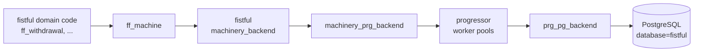
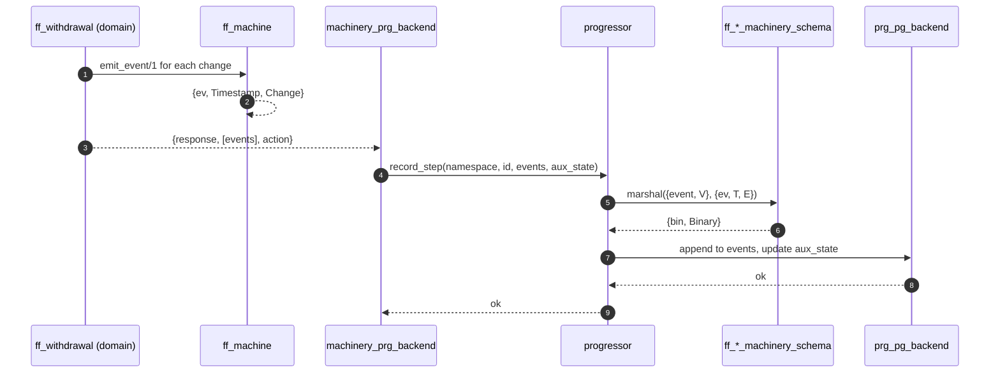
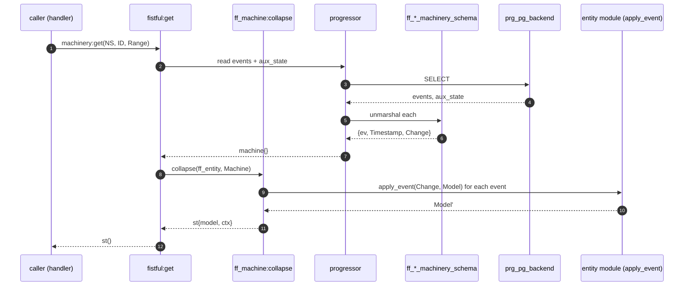

# Persistence

Fistful uses [progressor](https://github.com/valitydev/progressor) as its
state‑machine runtime, with PostgreSQL as the sole backing store. Every
domain entity is written as an append‑only event stream plus an
`aux_state` blob; state is reconstructed in memory from the event log on
demand.

## Layers



## Progressor configuration

[config/sys.config:34‑134](../config/sys.config#L34) configures progressor
with:

- A shared PostgreSQL connection pool `default_pool` of size 10
  ([sys.config:27‑30](../config/sys.config#L27)).
- A common default block:

  ```erlang
  #{
      storage         => #{client => prg_pg_backend,
                           options => #{pool => default_pool}},
      retry_policy    => #{initial_timeout => 5,
                           backoff_coefficient => 1.0,
                           max_timeout => 180,
                           max_attempts => 3,
                           non_retryable_errors => []},
      task_scan_timeout   => 1,
      worker_pool_size    => 100,
      process_step_timeout => 30
  }
  ```

- One `namespaces` map entry per machinery namespace, each specifying a
  `processor` (the machinery backend) with:
  - `namespace` — e.g. `'ff/withdrawal_v2'`.
  - `handler` — `{fistful, #{handler => ff_withdrawal_machine, party_client => #{}}}`.
  - `schema` — a `machinery_mg_schema` implementation (see below).

At startup,
[`ff_server:get_namespaces_params/0`](../apps/ff_server/src/ff_server.erl#L139)
reads this configuration back out and registers a `machinery_prg_backend`
child spec under the application environment key `fistful.backends` (one
per namespace). Domain code later obtains a backend with
[`fistful:backend/1`](../apps/fistful/src/fistful.erl#L36).

## Schema modules

Each namespace has a schema module under
[apps/ff_server/src](../apps/ff_server/src/) that implements
`machinery_mg_schema`:

| Namespace | Schema module |
|-----------|---------------|
| `ff/source_v1` | [`ff_source_machinery_schema`](../apps/ff_server/src/ff_source_machinery_schema.erl) |
| `ff/destination_v2` | [`ff_destination_machinery_schema`](../apps/ff_server/src/ff_destination_machinery_schema.erl) |
| `ff/deposit_v1` | [`ff_deposit_machinery_schema`](../apps/ff_server/src/ff_deposit_machinery_schema.erl) |
| `ff/withdrawal_v2` | [`ff_withdrawal_machinery_schema`](../apps/ff_server/src/ff_withdrawal_machinery_schema.erl) |
| `ff/withdrawal/session_v2` | [`ff_withdrawal_session_machinery_schema`](../apps/ff_server/src/ff_withdrawal_session_machinery_schema.erl) |

A schema exposes:

```erlang
-spec get_version(value_type()) -> machinery_mg_schema:version().
-spec marshal(type(), value(data()), context()) -> {machinery_msgpack:t(), context()}.
-spec unmarshal(type(), machinery_msgpack:t(), context()) -> {value(data()), context()}.
```

The implementation pattern is: convert the Erlang event to a Thrift
struct via the corresponding `ff_*_codec` (e.g. `TimestampedChange`),
serialize with `ff_proto_utils:serialize/2`, wrap in a `{bin, Binary}`
msgpack value. `aux_state` is handled similarly for the `ff_entity_context`.

### Versioning

Each schema tags events with a version number. On unmarshal, an older
version is either accepted directly (if the Thrift struct is
backwards‑compatible) or passed through a migration step in the domain
module — see each entity's `maybe_migrate/2` callback (e.g.
[`ff_withdrawal:maybe_migrate/2`](../apps/ff_transfer/src/ff_withdrawal.erl)).

## PostgreSQL database

Database name: `fistful`; owner: `fistful` (see
[sys.config:17‑25](../config/sys.config#L17)). Created as part of the
[compose.yaml](../compose.yaml) stack — the `db` service runs a Postgres
15 image with a multi‑database init script
(`POSTGRES_MULTIPLE_DATABASES="fistful,bender,dmt,party_management,shumway,liminator"`
in [compose.yaml:134](../compose.yaml#L134)). The init SQL lives under
[test/postgres/docker-entrypoint-initdb.d/](../test/postgres/).

Schema migrations for progressor are applied automatically by the library
when the first namespace registers.

## Event append path



## Read path



## Health and readiness

The readiness probe in
[sys.config:257‑269](../config/sys.config#L257) includes a progressor
check:

```erlang
progressor => {progressor, health_check, [[
    'ff/source_v1', 'ff/destination_v2', 'ff/deposit_v1',
    'ff/withdrawal_v2', 'ff/withdrawal/session_v2'
]]}
```

This confirms each configured namespace is registered and its worker
pool is alive. Note that `ff/identity` and `ff/wallet_v2` are **not** in
the readiness list — consistent with those namespaces no longer being
served by local machines.

## Contexts (`aux_state`)

The `aux_state` blob holds the `ff_entity_context:context()` — arbitrary
client‑defined metadata stored alongside the machine. Every
`ff_machine:emit_event/1` write also rewrites the aux state if the
context changed.

## Trace / introspection

`machinery:trace/3` (wrapped by
[`ff_machine:trace/2`](../apps/fistful/src/ff_machine.erl#L58)) returns a
JSON‑serializable dump of the full event history. Exposed over HTTP via
[`ff_machine_handler`](../apps/ff_server/src/ff_machine_handler.erl) for
post‑mortem inspection.

> [!WARNING]
> The trace endpoint is **not** authenticated. It is only exposed on the
> internal `:8022` port; lock the port down at the network layer.

## The `machinery_extra` in‑memory backend

[`machinery_gensrv_backend`](../apps/machinery_extra/src/machinery_gensrv_backend.erl)
provides an in‑memory alternative to progressor for tests that don't
need to exercise the storage layer (or for experimental hot‑path
measurements). It is registered by name rather than namespace, and
events live in the `gen_server` state — no migrations, no persistence.
Production does **not** use this backend.
