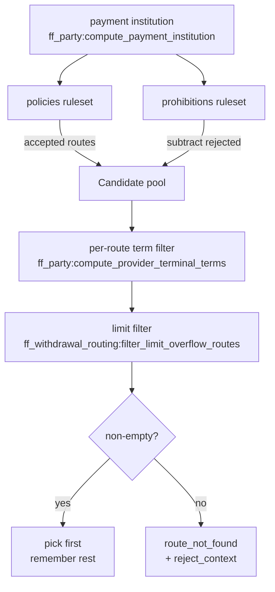

# Routing

Routing selects the `(provider_id, terminal_id)` pair a withdrawal will
attempt. The logic is split across three modules:

- [`ff_withdrawal_routing`](../apps/ff_transfer/src/ff_withdrawal_routing.erl) — orchestration.
- [`ff_routing_rule`](../apps/fistful/src/ff_routing_rule.erl) — ruleset evaluation.
- [`ff_limiter`](../apps/ff_transfer/src/ff_limiter.erl) — turnover‑limit filtering.

## Mental model

A payment institution (PI) has two routing rulesets attached:

1. **Policies** — positive rules that accept routes.
2. **Prohibitions** — negative rules that reject routes.

The effective candidate set is *policies minus prohibitions*. Each
candidate is then filtered by its provider/terminal's withdrawal
provision terms (currency, methods, cash range, payment system) and
finally by turnover limits held through the external `limiter` service.
The first accepted route is chosen; the rest are kept in an attempt index
so that a failed session can fall forward to the next candidate.

## Flow



## Entry point

[`ff_withdrawal_routing:prepare_routes/2,3`](../apps/ff_transfer/src/ff_withdrawal_routing.erl#L72):

```erlang
-spec prepare_routes(party_varset(), routing_context()) ->
    {ok, [route()]} | {error, route_not_found()}.
-type routing_context() :: #{
    domain_revision := domain_revision(),
    wallet          := wallet(),
    iteration       := pos_integer(),
    withdrawal      => withdrawal()
}.
```

It builds a `routing_state` = `#{routes, reject_context}` by:

1. Fetching the PI for the wallet via
   [`ff_party:compute_payment_institution/3`](../apps/fistful/src/ff_party.erl#L74).
2. Calling
   [`ff_routing_rule:gather_routes/4`](../apps/fistful/src/ff_routing_rule.erl)
   with the PI's `withdrawal_routing_rules` and the party varset. The
   return is a `{Accepted, RejectContext}` pair — the reject context is
   an accumulator that lists every route that was dropped and why.
3. Filtering the accepted list by terminal‑level terms (ever‑present in
   each provider/terminal config).
4. If `withdrawal` is present in the context (i.e. we're creating a real
   withdrawal, not just computing a quote), calling
   [`filter_limit_overflow_routes/3`](../apps/ff_transfer/src/ff_withdrawal_routing.erl#L10)
   to drop routes whose `limiter` turnover limits would overflow.
5. Returning `{ok, Routes}` or `{error, {route_not_found, Rejected}}`.

## Routing rules

[`ff_routing_rule:route/0`](../apps/fistful/src/ff_routing_rule.erl):

```erlang
-type route() :: #{
    provider_ref := provider_ref(),
    terminal_ref := terminal_ref(),
    priority     := integer(),
    weight       => integer()
}.

-type reject_context() :: #{
    varset           := varset(),
    accepted_routes  := [route()],
    rejected_routes  := [rejected_route()]
}.
```

Evaluation reduces DMT selectors against the supplied party varset. When
a route fails evaluation (e.g. a selector demands `Currency = USD` but
the varset has `Currency = RUB`), the route is appended to
`rejected_routes` with the reason, and
[`ff_routing_rule:log_reject_context/1`](../apps/fistful/src/ff_routing_rule.erl)
is later called to surface the reasons in logs — invaluable when
debugging "why did my withdrawal not route".

## Per‑route term filter

For every candidate route, a dedicated
[`ff_party:compute_provider_terminal_terms/4`](../apps/fistful/src/ff_party.erl#L76)
is reduced to produce the provider/terminal's
`WithdrawalProvisionTerms`. The candidate is rejected if:

- Currency is not in `currencies` selector.
- Withdrawal method (e.g. `{bank_card, VISA}`) is not in `methods`
  selector.
- Cash amount is outside `cash_limit` selector.
- Payment system doesn't match `payment_system` selector.

The `process_route_fun` type
([ff_withdrawal_routing.erl:63](../apps/ff_transfer/src/ff_withdrawal_routing.erl#L63))
describes the validator signature.

## Turnover limit filter

Each provider/terminal can declare **turnover limits** in DMT (a
`TurnoverLimitSelector` of `[TurnoverLimit]`). For each limit fistful
holds capacity in the external `limiter` service. See
[`ff_limiter:check_limits/4`](../apps/ff_transfer/src/ff_limiter.erl#L39):

```erlang
-spec check_limits([turnover_limit()], withdrawal(), route(), pos_integer()) ->
    {ok, [limit()]} |
    {error, {overflow, [{limit_id(), limit_amount(), upper_boundary()}]}}.
```

The request carries a context built by
[`gen_limit_context/2`](../apps/ff_transfer/src/ff_limiter.erl) that
includes a marshalled domain withdrawal, the wallet identity, and an
**operation segment list** from
[`make_operation_segments/3`](../apps/ff_transfer/src/ff_limiter.erl#L52):

```
[provider_id, terminal_id, withdrawal_id, iteration?]
```

The operation ID is the concatenation of these segments — this is what
the limiter uses to make hold/commit/rollback idempotent per attempt. On
a retry with the same iteration, the limiter no‑ops; a new iteration
produces a distinct operation ID and a distinct reservation.

## Commit and rollback

Once a posting transfer commits successfully,
[`ff_withdrawal_routing:commit_routes_limits/3`](../apps/ff_transfer/src/ff_withdrawal_routing.erl#L11)
finalises the limit holds. On failure,
[`ff_withdrawal_routing:rollback_routes_limits/3`](../apps/ff_transfer/src/ff_withdrawal_routing.erl#L11)
releases them. Both are called from
[`ff_withdrawal:do_process_transfer/2`](../apps/ff_transfer/src/ff_withdrawal.erl#L745)
next to their posting‑transfer counterparts.

## Multi‑attempt routing

When a session fails on one route, the withdrawal doesn't have to fail
globally. The set of available routes is captured during the first
`process_routing` step. Each attempt:

- Picks the next not‑yet‑attempted route.
- Rebuilds the cash flow with that provider's plan and fees.
- Starts a *new* posting transfer (new ID including iteration) and a new
  session.
- Holds fresh turnover limits under a new operation ID.

[`ff_withdrawal_route_attempt_utils`](../apps/ff_transfer/src/ff_withdrawal_route_attempt_utils.erl)
holds the per‑attempt data: route, transfer, session. The withdrawal
`attempts` field tracks this:

```erlang
-type attempts() :: ff_withdrawal_route_attempt_utils:attempts().
```

When all candidate routes are exhausted, the withdrawal transitions to
`{failed, Failure}`. The final iteration is also used when rolling back
routing limits (so holds from *every* attempted route are released).

## Edge cases

> [!WARNING]
> Transient errors (e.g.
> `authorization_failed:temporarily_unavailable`) are treated specially —
> the limit hold is **not** released and the route is kept for retry.
> Configured via
> [`ff_transfer.withdrawal.default_transient_errors`](../config/sys.config#L222)
> and the per‑party override
> [`ff_transfer.withdrawal.party_transient_errors`](../config/sys.config#L227).

> [!NOTE]
> Routing terms failures have been a source of outages: a prior bug
> crashed the machine when a provider had no withdrawal terms; now
> `ff_withdrawal_routing` guards against missing terms (see commit
> `abee5cd — fix withdrawal routing crash when terms not found`).
