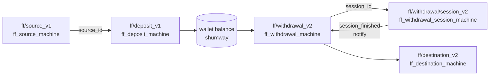
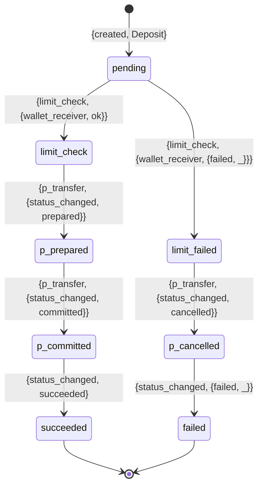
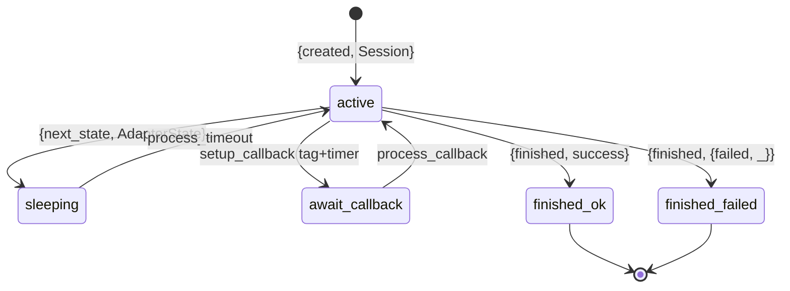

# State Machines

Every processable domain entity is a `machinery:machine`. The common
scaffolding lives in [`ff_machine`](../apps/fistful/src/ff_machine.erl)
and the progressor ↔ handler glue lives in
[`fistful`](../apps/fistful/src/fistful.erl).

## Machinery callbacks

The [`ff_machine`](../apps/fistful/src/ff_machine.erl#L76) behaviour pins
down six callbacks each entity module must implement:

```erlang
-callback init(machinery:args(_)) -> [event()].
-callback apply_event(event(), model()) -> model().
-callback maybe_migrate(event(), migrate_params()) -> event().   %% optional
-callback process_call(machinery:args(_), st()) -> {machinery:response(_), [event()]}.
-callback process_repair(machinery:args(_), st()) ->
              {ok, machinery:response(_), [event()]} | {error, machinery:error(_)}.
-callback process_timeout(st()) -> [event()].
```

`process_notification/2` is defined on a per‑entity basis — e.g. the
withdrawal machine uses it to react to session completion.

Event emission is funneled through `ff_machine:emit_event/1`, which wraps
the raw change in a `{ev, CurrentTimestamp, Change}` triple — giving every
logged event its own timestamp.

## Namespace catalogue



## Source machine — `ff/source_v1`

Module: [`ff_source_machine`](../apps/ff_transfer/src/ff_source_machine.erl).

- Public API: `create/2`, `get/1,2`, `events/2`.
- `init/1` emits `[{created, Source}]` plus an optional `{auth_data_changed, _}`.
- `process_timeout/1` is effectively a no‑op; sources have no ongoing processing.
- `process_repair` delegates to `ff_repair:apply_scenario/3` with
  `add_events` support.

## Destination machine — `ff/destination_v2`

Module: [`ff_destination_machine`](../apps/ff_transfer/src/ff_destination_machine.erl).

Symmetric to the source machine. Destinations additionally carry
`auth_data` for tokenised card payouts, set on creation via
`{auth_data_changed, ...}`.

## Deposit machine — `ff/deposit_v1`

Module: [`ff_deposit_machine`](../apps/ff_transfer/src/ff_deposit_machine.erl).



The activity dispatcher lives in
[`ff_deposit`](../apps/ff_transfer/src/ff_deposit.erl) (`process_transfer/1`)
and walks: receiver limit check → posting transfer → commit → finish, with
compensation on failure. Unlike withdrawals, there is no routing and no
session.

## Withdrawal machine — `ff/withdrawal_v2`

Module: [`ff_withdrawal_machine`](../apps/ff_transfer/src/ff_withdrawal_machine.erl).
Driven by [`ff_withdrawal:process_transfer/1`](../apps/ff_transfer/src/ff_withdrawal.erl#L557).

The activity for a given state is computed by
[`deduce_activity/1`](../apps/ff_transfer/src/ff_withdrawal.erl#L685) from a
tuple of sub‑statuses — see the table:

| `status` | `route` | `p_transfer` | `limit_check` | `session` | → activity |
|----------|---------|--------------|---------------|-----------|------------|
| pending | unknown | undefined | — | — | `routing` |
| pending | found | undefined | — | — | `p_transfer_start` |
| pending | — | created | — | — | `p_transfer_prepare` |
| pending | — | prepared | unknown | — | `limit_check` |
| pending | — | prepared | ok | undefined | `session_starting` |
| pending | — | prepared | — | pending | `session_sleeping` |
| pending | — | prepared | — | succeeded | `p_transfer_commit` |
| pending | — | committed | — | succeeded | `finish` |
| pending | — | prepared | — | failed | `p_transfer_cancel` |
| pending | — | prepared | failed | — | `p_transfer_cancel` |
| pending | — | cancelled | failed | — | `{fail, limit_check}` |
| pending | — | cancelled | — | failed | `{fail, session}` |
| succeeded/failed | — | — | — | — | `adjustment` or `rollback_routing` |

Each activity is then dispatched by
[`do_process_transfer/2`](../apps/ff_transfer/src/ff_withdrawal.erl#L735).
See [withdrawal-flow.md](withdrawal-flow.md) for the full narrative.

> [!NOTE]
> Calls: the withdrawal machine implements `process_call` for
> `start_adjustment`. Notifications: it implements `process_notification`
> to receive `{session_finished, SessionID, Result}` messages from a
> session machine that just completed.

## Withdrawal session machine — `ff/withdrawal/session_v2`

Module: [`ff_withdrawal_session_machine`](../apps/ff_transfer/src/ff_withdrawal_session_machine.erl).



`process_session/1` in
[`ff_withdrawal_session`](../apps/ff_transfer/src/ff_withdrawal_session.erl)
calls the configured adapter's
[`ProcessWithdrawal`](../apps/ff_transfer/src/ff_adapter_withdrawal.erl)
RPC. The adapter returns an `intent`:

- `{finish, Status}` → session emits `{finished, Status}` and finishes.
- `{sleep, #{timer, callback_tag => ..., user_interaction => ...}}` →
  the machine schedules a timeout (and optionally registers a tag so a
  callback from the adapter can find this session).

Callbacks arrive via the
[`ff_withdrawal_adapter_host`](../apps/ff_server/src/ff_withdrawal_adapter_host.erl)
Thrift endpoint (`ProcessCallback`) and are dispatched to the session by
`ff_withdrawal_session_machine:process_callback/1` — see
[adapter-integration.md](adapter-integration.md).

### Retries

Defined in [`ff_withdrawal_session_machine`](../apps/ff_transfer/src/ff_withdrawal_session_machine.erl)
as:

- total retry time limit: 24 h
- max sleep between retries: 4 h

When an adapter `ProcessWithdrawal` returns a transient failure, the
session schedules a retry rather than immediately failing out.

## Identity and wallet machines — legacy

`ff/identity` and `ff/wallet_v2` are still configured in
[sys.config:56‑77](../config/sys.config#L56) but their `.erl` sources
(`ff_identity_machine`, `ff_wallet_machine`) are **not** present in this
working tree. Live party/wallet data is served from `party-management` via
[`ff_party`](../apps/fistful/src/ff_party.erl). Historical identity/wallet
machines in existing PostgreSQL stores remain readable by the progressor
for backwards compatibility.

## Serialization

Each namespace has a paired **schema** module under
[apps/ff_server/src/](../apps/ff_server/src/) that implements
`machinery_mg_schema`:

- Marshals `{event, Version}` changes through per‑entity Thrift structs
  (`TimestampedChange`, etc.).
- Stores the `ctx :: ff_entity_context:context()` in `aux_state`.
- Handles migrations when an older event format is read back.

See [persistence.md](persistence.md) for how that interacts with progressor.

## Repair

Every machine implements `process_repair/4` through
[`ff_repair:apply_scenario/3`](../apps/fistful/src/ff_repair.erl). Built‑in
support: the `add_events` scenario which appends arbitrary events to fix up
broken state. Entity‑specific handling lives in each Thrift repair handler
([`ff_withdrawal_repair`](../apps/ff_server/src/ff_withdrawal_repair.erl),
[`ff_deposit_repair`](../apps/ff_server/src/ff_deposit_repair.erl),
[`ff_withdrawal_session_repair`](../apps/ff_server/src/ff_withdrawal_session_repair.erl)).
