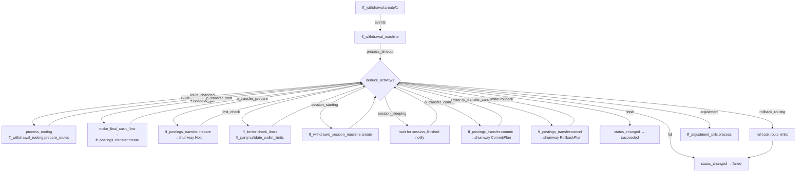
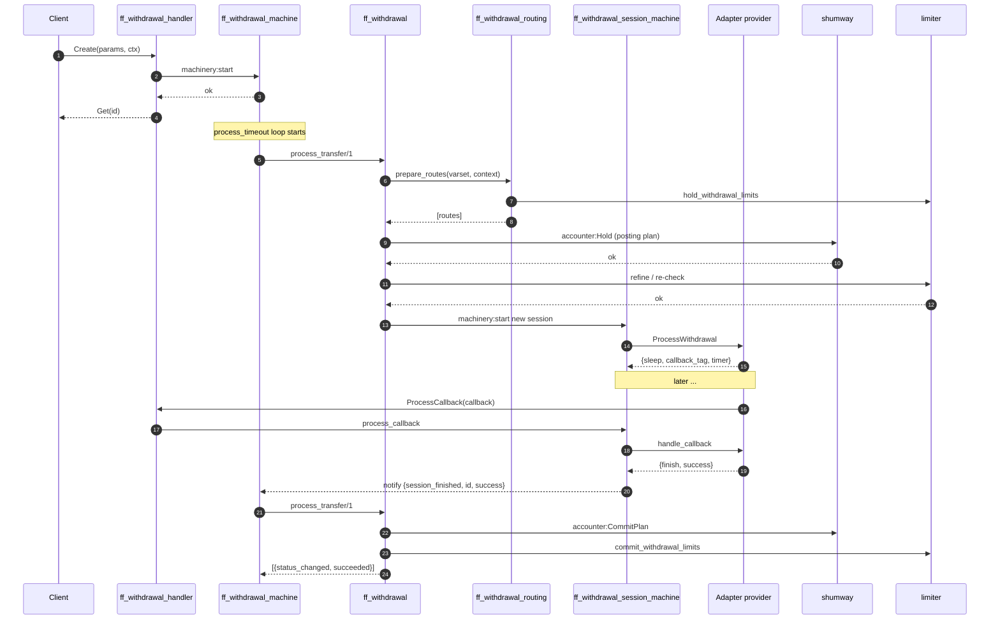

# Withdrawal Flow

A withdrawal moves money *out* of a wallet to an external destination
through a provider. It is the most complex flow in fistful: it touches
routing, double‑entry accounting, external limiter reservations, an
adapter session machine, optional callbacks from the provider, retry
with route exhaustion, and — after the fact — optional adjustments.

## Mental model

1. A client calls `Create` on the withdrawal management service.
2. The withdrawal machine is persisted in `pending` status with minimal
   fields — just enough to re‑derive everything deterministically.
3. Progressor wakes the machine via `process_timeout`. The machine walks
   an **activity chain** until it either reaches `succeeded`, `failed`,
   or is suspended waiting for a session / adapter callback.
4. Each activity is a deterministic function of the current
   `ff_withdrawal:withdrawal_state()`. Idempotency is built in — the same
   input events always produce the same next action.
5. Every money‑moving step is double‑booked: the *intent* is recorded as
   a fistful event, and the actual debit/credit is delegated to
   `shumway` via `ff_postings_transfer`.

## Flowchart

## Sequence diagram

## Step detail

### 1. Create

Entry: [`ff_withdrawal_handler:handle_function('Create', ...)`](../apps/ff_server/src/ff_withdrawal_handler.erl#L69).

Steps performed before the machine is started:

1. Unmarshal params via
   [`ff_withdrawal_codec:unmarshal_withdrawal_params/1`](../apps/ff_server/src/ff_withdrawal_codec.erl).
2. Scoper: `withdrawal` + params (`id`, `wallet_id`, `destination_id`,
   `external_id`).
3. `ff_withdrawal_machine:create(Params, Context)` →
   [`ff_withdrawal:create/1`](../apps/ff_transfer/src/ff_withdrawal.erl#L423)
   inside `do/1`:
   - Fetch party + wallet via `ff_party:get_party/1` and
     `ff_party:get_wallet/3`.
   - Fetch destination via `ff_destination_machine:get/1`.
   - Ensure wallet accessibility (`is_wallet_accessible/1`).
   - Validate currencies match (withdrawal vs wallet vs destination).
   - Validate realms match (test/live).
   - Call `ff_party:validate_withdrawal_creation/3` against domain terms:
     allowed currency, cash range, allowed withdrawal method.
   - Produce `[{created, Withdrawal}]` + `{resource_got, Resource}` if the
     destination's resource needs BIN enrichment.

The returned errors are mapped 1:1 onto Thrift business exceptions in
[ff_withdrawal_handler.erl:69‑113](../apps/ff_server/src/ff_withdrawal_handler.erl#L69).

### 2. Routing (`process_routing`)

[`ff_withdrawal:process_routing/1`](../apps/ff_transfer/src/ff_withdrawal.erl#L773)
delegates to
[`ff_withdrawal_routing:prepare_routes/2`](../apps/ff_transfer/src/ff_withdrawal_routing.erl#L72).

1. Build a **varset** via `ff_varset` that includes the wallet, cash,
   destination method, etc. — this is what selectors get reduced against.
2. Compute the **payment institution** for the wallet via
   `ff_party:compute_payment_institution/3`.
3. Evaluate the PI's `withdrawal_routing_rules`:
   - Apply policies routing ruleset → accepted routes.
   - Apply prohibitions routing ruleset → subtract forbidden routes.
4. For each candidate route, evaluate the provider/terminal terms
   (`ff_party:compute_provider_terminal_terms/4`) against the varset —
   this filters by currency, method, cash ranges.
5. Use [`ff_limiter:check_limits/4`](../apps/ff_transfer/src/ff_limiter.erl#L39)
   to filter out routes whose turnover limits would overflow.
6. Emit `{route_changed, Route}`. The first accepted route wins; the rest
   are remembered via
   [`ff_withdrawal_route_attempt_utils`](../apps/ff_transfer/src/ff_withdrawal_route_attempt_utils.erl)
   so subsequent attempts can pick the next candidate.

If nothing matches, `{error, {route, {route_not_found, [RejectedRoutes]}}}`
propagates back to the handler as a `WithdrawalSessionFailure`. The reject
context (why each route was dropped) is logged by
[`ff_routing_rule:log_reject_context/1`](../apps/fistful/src/ff_routing_rule.erl).

### 3. Posting transfer start and prepare

[`ff_withdrawal:make_final_cash_flow/1,2`](../apps/ff_transfer/src/ff_withdrawal.erl#L1009)
builds the plan cash flow from the provider's cash‑flow plan in DMT plus
provider/terminal fees, then calls `ff_cash_flow:finalize/3` to resolve
plan accounts (wallet's account ID on the debit side, provider settlement
account on the credit side, plus system settlement / subagent accounts for
fees).

[`ff_postings_transfer:create/2`](../apps/fistful/src/ff_postings_transfer.erl#L77)
validates the accounts (same currency, same realm, accessible) and emits
`{created, Transfer}` + `{status_changed, created}`.

`p_transfer_prepare` calls
[`ff_postings_transfer:prepare/1`](../apps/fistful/src/ff_postings_transfer.erl#L44)
which invokes
[`ff_accounting:prepare_trx/2`](../apps/fistful/src/ff_accounting.erl#L58) —
this is the `Hold` Thrift call on `shumway`. On success the status
transitions to `prepared`. **At this point** funds are reserved but not
yet released on either side.

### 4. Limit check

[`ff_withdrawal:process_limit_check/1`](../apps/ff_transfer/src/ff_withdrawal.erl#L882)
emits a `{limit_check, {wallet_sender, ok | {failed, _}}}` event. The
actual balance check is done by
[`ff_party:validate_wallet_limits/2`](../apps/fistful/src/ff_party.erl#L72):
the wallet's current balance (from shumway) plus the held amount must not
drop below the wallet's configured cash range.

If the limit check fails, the activity table jumps to `p_transfer_cancel`
and then `{fail, limit_check}`; the resulting withdrawal status is
`{failed, {inner_failure, ...}}`.

### 5. Session creation

[`ff_withdrawal:process_session_creation/1`](../apps/ff_transfer/src/ff_withdrawal.erl#L919)
constructs a deterministic session ID
([`construct_session_id/1`](../apps/ff_transfer/src/ff_withdrawal.erl#L955))
and starts a new session machine with
`ff_withdrawal_session_machine:create(ID, Data, Params)`.

The session runs in its own machinery namespace and — importantly — in its
own machinery worker. It processes adapter RPCs, sleeps between retries,
handles callbacks, and notifies the owning withdrawal on finish. See
[adapter-integration.md](adapter-integration.md) for the RPC protocol.

### 6. Session sleeping

[`ff_withdrawal:process_session_sleep/1`](../apps/ff_transfer/src/ff_withdrawal.erl#L977)
returns `{sleep, []}` — the withdrawal machine stops processing and waits
for a notification. The session ultimately calls back through
[`ff_withdrawal_machine:notify/2`](../apps/ff_transfer/src/ff_withdrawal_machine.erl#L58)
with `{session_finished, SessionID, Result}`. `process_notification` in
the withdrawal machine feeds that into
[`ff_withdrawal:finalize_session/3`](../apps/ff_transfer/src/ff_withdrawal.erl#L573)
which appends a `{session_finished, ...}` event and wakes the withdrawal.

### 7. Commit / cancel

On session success: `p_transfer_commit` calls
[`ff_postings_transfer:commit/1`](../apps/fistful/src/ff_postings_transfer.erl#L45)
(shumway `CommitPlan`), then
[`ff_withdrawal_routing:commit_routes_limits/3`](../apps/ff_transfer/src/ff_withdrawal_routing.erl#L11)
for the external turnover limiter, then refreshes the wallet balance via
[`ff_party:wallet_log_balance/2`](../apps/fistful/src/ff_party.erl#L63).

On session failure (or limit failure): `p_transfer_cancel` calls
[`ff_postings_transfer:cancel/1`](../apps/fistful/src/ff_postings_transfer.erl#L46)
(shumway `RollbackPlan`) and
[`ff_withdrawal_routing:rollback_routes_limits/3`](../apps/ff_transfer/src/ff_withdrawal_routing.erl#L11).

If one route failed but other candidates remain, the machine enters a new
`routing` iteration (see
[`update_attempts/2`](../apps/ff_transfer/src/ff_withdrawal.erl#L631)) and
picks the next route — a fresh `{route_changed, _}`, a new session with a
distinct ID (the route iteration is folded into the session ID), fresh
hold/commit.

### 8. Terminal state

`{status_changed, succeeded}` or `{status_changed, {failed, failure()}}`
is emitted by `process_transfer_finish/1` or `process_transfer_fail/2`
([ff_withdrawal.erl:981](../apps/ff_transfer/src/ff_withdrawal.erl#L981)).

Once finished, the only further activities are adjustments (see
[adjustments.md](adjustments.md)).

## Quote flow (`GetQuote`)

A withdrawal can be *quoted* without being created — useful to show the
user the expected exchange rate / fees before committing.

[`ff_withdrawal:get_quote/1`](../apps/ff_transfer/src/ff_withdrawal.erl#L236)
runs the same party/wallet/destination/terms checks as `Create`, selects a
route, and asks the provider's adapter for a quote via
[`ff_adapter_withdrawal:get_quote/3`](../apps/ff_transfer/src/ff_adapter_withdrawal.erl).
The result is a sealed `quote()` (with `created_at`, `expires_on`,
`quote_data`, `route`, `resource_descriptor`) that can later be passed back
into `Create` — the withdrawal will bypass routing and session‑ID
derivation, instead using the quote's frozen route and resource.

## Error paths and exceptions

| Domain error | Thrift exception raised |
|--------------|-------------------------|
| `{party, notfound}` | `#fistful_PartyNotFound{}` |
| `{wallet, notfound}` | `#fistful_WalletNotFound{}` |
| `{wallet, {inaccessible, _}}` | `#fistful_WalletInaccessible{id}` |
| `{destination, notfound}` | `#fistful_DestinationNotFound{}` |
| `{destination, unauthorized}` | `#fistful_DestinationUnauthorized{}` |
| `{terms, {terms_violation, {not_allowed_currency, _}}}` | `#fistful_ForbiddenOperationCurrency{}` |
| `{terms, {terms_violation, {cash_range, _}}}` | `#fistful_ForbiddenOperationAmount{}` |
| `{terms, {terms_violation, {not_allowed_withdrawal_method, _}}}` | `#fistful_ForbiddenWithdrawalMethod{}` |
| `{inconsistent_currency, {...}}` | `#wthd_InconsistentWithdrawalCurrency{}` |
| `{realms_mismatch, {...}}` | `#fistful_RealmsMismatch{}` |

The full mapping lives in
[ff_withdrawal_handler.erl:69‑113](../apps/ff_server/src/ff_withdrawal_handler.erl#L69).

## Idempotence

- **Create** — a second call with the same `id` returns the existing
  withdrawal's state (`{error, exists}` is treated as success by the
  handler; see [ff_withdrawal_handler.erl:77](../apps/ff_server/src/ff_withdrawal_handler.erl#L77)).
- **Posting transfer** — the transfer ID is derived deterministically from
  the withdrawal's route and iteration via
  [`construct_p_transfer_id/1`](../apps/ff_transfer/src/ff_withdrawal.erl#L962).
  shumway deduplicates Hold/Commit on this ID.
- **Session** — session ID is constructed from withdrawal ID + route +
  iteration. A crashed worker restarting does not create a second session.
- **Limiter holds** — idempotent on `(limit_id, operation_id)` where
  `operation_id` embeds provider, terminal, withdrawal, iteration (see
  [`ff_limiter:make_operation_segments/3`](../apps/ff_transfer/src/ff_limiter.erl#L52)).

> [!WARNING]
> There's a known gap: `GetQuote` has no handler clause for
> `{error, {route, {route_not_found, _}}}` (see TODO at
> [ff_withdrawal_handler.erl:35](../apps/ff_server/src/ff_withdrawal_handler.erl#L35)).
> A quote request against an unroutable pair will surface as a generic
> Woody system error rather than a typed business error.
